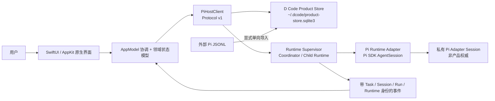

# 架构与运行

本目录记录已经由源码和运行验证成立的当前架构，不承载未来设想或版本需求。

> Candidate boundary（候选边界）：当前 checkout 已实现 `0.0.28` Product Store 与多 Runtime 纵切，并通过 Host / Swift 自动测试；它尚未形成 commit、发布产物或原生人工验收。以下只描述源码和自动验证已经成立的结构，不把候选等同于发布。

## D Code Harness 当前边界

D Code 当前实现不是 Pi CLI 的界面封装。D Code Product Store 拥有 Project、Task、D Code Session、Raw / Effective Input、Team / Agent / Session Run、Prompt Receipt、Attempt、Request、Report、Artifact 与 Evidence 等产品事实；Runtime Supervisor 按稳定身份管理多个 Pi AgentSession。Pi SDK 只提供模型循环、工具执行和私有适配会话。

每个 D Code Runtime 在 Provider 请求前冻结 D Code Identity、Agent Role、项目一等文档来源和真实 Active Tool Manifest；Product Store 原子写入 Effective Input、Session Run、Prompt Receipt 与 Provider Attempt 后才允许请求。Pi 默认 System Prompt、自动 Skill / project context 和外部扩展不会进入该 Runtime。

| 层 | 当前职责 | 主要入口 |
|---|---|---|
| Native App（原生应用） | App 启动、响应式工作台、输入与状态呈现 | [`PiDCodeApp.swift`](../../app/Sources/PiDCode/PiDCodeApp.swift)、[`Views/`](../../app/Sources/PiDCode/Views/) |
| Product Store（产品数据库） | 版本化 SQLite schema、单写入租约、原子迁移、幂等 mutation、Task / Session / Run / Attempt / Request / Report / Evidence 权威与恢复 | [`product-store.ts`](../../host/src/product-store.ts)、[`product-store-schema.ts`](../../host/src/product-store-schema.ts) |
| Foundation Console（基础控制台） | 使用正式 query / mutation contract 创建 Project / Task / Profile、预览导入、启动团队、切换观察、回答请求、停止成员和验收；不是 `0.0.29` 最终界面 | [`FoundationConsoleView.swift`](../../app/Sources/PiDCode/Views/FoundationConsoleView.swift) |
| Host Bridge（宿主桥） | 定位并启动配置指定的 Node/Host 进程，通过 Protocol v1 关联请求、响应和事件；App Bundle 默认使用包内运行时 | [`HostLocator.swift`](../../app/Sources/PiDCode/Host/HostLocator.swift)、[`PiHostClient.swift`](../../app/Sources/PiDCode/Host/PiHostClient.swift)、[`HostProtocol.swift`](../../app/Sources/PiDCode/Host/HostProtocol.swift) |
| Runtime Supervisor（运行时监督器） | 多 Runtime 路由、并发上限、单 Session / workspace 写入隔离、Project Git Worker 的受管 detached worktree、Coordinator 两阶段调度、Agent Request 等待与单成员停止 | [`pi-host.ts`](../../host/src/pi-host.ts)、[`managed-worker-worktree.ts`](../../host/src/managed-worker-worktree.ts)、[`runtime-supervisor.test.ts`](../../host/test/runtime-supervisor.test.ts) |
| Pi Adapter（Pi 适配层） | 通过固定 Pi SDK 运行独立 AgentSession，提供模型、工具与流式事件；外部 Pi Session 只作为显式导入来源 | [`host/src/`](../../host/src/)、[Node/Pi 宿主与 IPC](0001-Node-Pi-宿主与-IPC.md) |
| Native Presentation（原生呈现） | 把消息、Plan、Mermaid、工具结果和受支持扩展交互投影成 D Code 自有组件 | [`Views/`](../../app/Sources/PiDCode/Views/)、[原生界面设计系统](0002-D-Code-原生界面设计系统.md) |

同一 Host 现在可以保持多个显式 Runtime 活动；同一 Team 由 Coordinator 先规划、两个以上成员并行执行、成员 Report 落库后再由 Coordination Session 综合。切换 Foundation Console 的观察 Session / Run 只改变呈现选择，不关闭 Runtime。最终 Project → Task 导航、协调者主对话、常驻 Task HUD 与对象 Inspector 仍属于 `0.0.29`，不能从基础控制台推断为已经交付。

## 权威与数据所有权

以下是当前实现权威：

- `~/.dcode/product-store.sqlite3` 是 D Code 产品事实的唯一数据库；Project 文件正文仍留在真实项目目录。
- Swift 不直接写 Product Store 或 Pi JSONL；所有 mutation 经 Host 的 revision、request ID 与目标身份合同执行。
- 外部 Pi JSONL 保持源字节不变，只在用户预览并点击“导入为任务”后转换；导入后的 D Code Session 不双写回 Pi。
- Pi Adapter 的私有 JSONL 只服务固定 SDK 运行与恢复，不定义 D Code Task / Session 历史。
- 用户可见界面由 D Code 原生组件拥有；Host 只发送结构化事件，不传递或重绘终端画面。
- Product Store 同时只有一个进程写入所有者；同一 D Code Session 同时最多一个活动写 Run。共享 workspace 只有在冻结后的全部活动工具可证明只读时才成立。

## 当前文档

- [Node/Pi 宿主与 IPC](0001-Node-Pi-宿主与-IPC.md)：Host 进程职责、Protocol v1、会话生命周期、可见会话搜索、路径协议、完整会话复制、归档可见性排除、本机草稿/归档边界与验证入口。
- [D Code 原生界面设计系统](0002-D-Code-原生界面设计系统.md)：当前 SwiftUI/AppKit 界面的设计性格、共享 token、组件几何、状态矩阵、无障碍边界与视觉验收方法。
