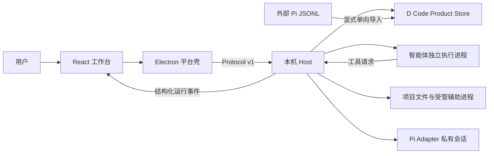

# 架构与运行

本目录记录已经由源码和运行验证成立的当前架构，不承载未来设想或版本需求。

> 当前界面入口是 Electron + React `client/`。旧 Swift 客户端已按迁移边界退役，品牌和 Host 原生文件辅助程序保留。当前源码、独立批次、窗口走查与人工验收状态见[版本实施方案](../40-版本实施方案/README.md)，不以源码存在或测试通过代替发布。

## D Code Harness 当前边界

D Code 当前实现不是 Pi CLI 的界面封装。D Code Product Store 拥有 Project、Task、D Code Session、Raw / Effective Input、Team / Agent / Session Run、Prompt Receipt、Attempt、Request、Report、Artifact 与 Evidence 等产品事实；Runtime Supervisor 按稳定身份管理多个独立智能体执行进程和各自的 Pi AgentSession。Pi SDK 只提供模型循环、工具执行和私有适配会话。

每个 D Code Runtime 在 Provider 请求前冻结 D Code Identity、Agent Role、项目一等文档来源和真实 Active Tool Manifest；Product Store 原子写入 Effective Input、Session Run、Prompt Receipt 与 Provider Attempt 后才允许请求。Pi 默认 System Prompt、自动 Skill / project context 和外部扩展不会进入该 Runtime。

| 边界 | 当前职责 | 主要入口 |
|---|---|---|
| 客户端与平台壳 | 自有工作台、窗口、系统目录选择、通知、候选切换与安全退出 | [client](../../client/README.md)、[主进程](../../client/src/main/index.ts)、[候选切换](../../client/src/main/candidate-switch.ts) |
| Host Bridge（宿主桥） | 使用 Electron Node 模式启动 Host，通过 JSONL 关联请求、响应和退出状态 | [bridge.ts](../../client/src/host/bridge.ts)、[launch.ts](../../client/src/host/launch.ts) |
| Product Store（产品数据库） | 单写入、产品事实、原子结果/通知、幂等操作及中断恢复 | [product-store.ts](../../host/src/product-store.ts)、[schema](../../host/src/product-store-schema.ts) |
| Runtime Supervisor（运行时监督器） | 按需派发、单成员控制、目录保护、配额回退、独立验收与复核 | [pi-host.ts](../../host/src/pi-host.ts)、[工作树](../../host/src/managed-worker-worktree.ts) |
| Pi Adapter 与执行进程 | SDK 模型循环在独立进程执行；工具、存储和凭据仍由 Host 管理 | [process-agent.ts](../../host/src/process-agent.ts)、[进程协议](../../host/src/agent-process-protocol.ts) |
| 文件与进程辅助 | 原生安全文件操作、目录句柄校验及归属明确的辅助进程 | [WorkspaceFiles.swift](../../host/native/WorkspaceFiles.swift)、[Host 源码](../../host/src/) |

同一任务由协调者承接，成员按需要创建。主对话、定向消息和子对话使用耐久身份；切换观察对象不停止其他成员。成员完成、报告与通知交付、独立验收、协调复核和用户接受分别成立；保存失败不提前释放运行与写入保护。本机架构不引入跨机器 worker 或远程控制面。

## 权威与数据所有权

以下是当前实现权威：

- `~/.dcode/product-store.sqlite3` 是 D Code 产品事实的唯一数据库；Project 文件正文仍留在真实项目目录。
- 客户端不直接写 Product Store 或 Pi JSONL；所有 mutation 经 Host 的 revision、request ID 与目标身份合同执行。
- 外部 Pi JSONL 保持源字节不变，只在用户预览并点击“导入为任务”后转换；导入后的 D Code Session 不双写回 Pi。
- Pi Adapter 的私有 JSONL 只服务固定 SDK 运行与恢复，不定义 D Code Task / Session 历史。
- 用户可见界面由 D Code 原生组件拥有；Host 只发送结构化事件，不传递或重绘终端画面。
- Product Store 同时只有一个进程写入所有者；同一 D Code Session 同时最多一个活动写 Run。共享 workspace 只有在冻结后的全部活动工具可证明只读时才成立。

## 当前文档

- [Node/Pi 宿主与 IPC](0001-Node-Pi-宿主与-IPC.md)：Host 进程职责、Protocol v1、会话生命周期、可见会话搜索、路径协议、完整会话复制、归档可见性排除、本机草稿/归档边界与验证入口。
- [D Code 原生界面设计系统](0002-D-Code-原生界面设计系统.md)：设计语义和旧 Swift 几何参考；当前可执行样式见客户端共享样式与组件。
- [D Code Web 客户端技术栈](0003-Web客户端技术栈.md)：Electron + React 客户端主路径、参照实证与 Host 边界；[ADR 0044](../决策档案/0044-Web客户端与桌面壳技术栈边界.md) 已接受，`client/` 基础功能经 507 确认，具体验证与迁移收尾由 PRD 0028 维护。
