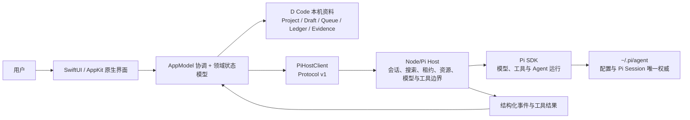

# 架构与运行

本目录记录已经由源码和运行验证成立的当前架构，不承载未来设想或版本需求。

## D Code Harness 当前边界

D Code 不是 Pi CLI 的界面封装。Pi 提供配置、Session（会话）、模型、工具和 Agent 运行能力；D Code Harness 负责把这些能力组织成 Project（项目）与工作上下文，管理 App 内的状态和生命周期，通过结构化协议安全调用 Pi，并以原生 macOS 界面呈现结果。

| 层 | 当前职责 | 主要入口 |
|---|---|---|
| Native App（原生应用） | App 启动、响应式工作台、输入与状态呈现 | [`PiDCodeApp.swift`](../../app/Sources/PiDCode/PiDCodeApp.swift)、[`Views/`](../../app/Sources/PiDCode/Views/) |
| Product State（产品状态） | `AppModel` 协调 Project / Session / Path、Prompt transaction 与打开即接管；搜索、活动、队列、模型、资源、供应商和自构建由领域状态模型承载 | [`State/`](../../app/Sources/PiDCode/State/) |
| Local Metadata（本机元数据） | 保存 Project、逐路径草稿、归档、置顶、Follow-up Queue、关注态、会话变更与验证证据；不复制 Pi 消息历史 | [`Models/`](../../app/Sources/PiDCode/Models/) |
| Host Bridge（宿主桥） | 定位并启动配置指定的 Node/Host 进程，通过 Protocol v1 关联请求、响应和事件；App Bundle 默认使用包内运行时 | [`HostLocator.swift`](../../app/Sources/PiDCode/Host/HostLocator.swift)、[`PiHostClient.swift`](../../app/Sources/PiDCode/Host/PiHostClient.swift)、[`HostProtocol.swift`](../../app/Sources/PiDCode/Host/HostProtocol.swift) |
| Pi Adapter（Pi 适配层） | 通过固定 Pi SDK 读取和运行会话，执行搜索、路径、复制、打开即接管、资源加载、模型设置 / 自定义供应商与结构化工具边界 | [`host/src/`](../../host/src/)、[Node/Pi 宿主与 IPC](0001-Node-Pi-宿主与-IPC.md) |
| Native Presentation（原生呈现） | 把消息、Plan、Mermaid、工具结果和受支持扩展交互投影成 D Code 自有组件 | [`Views/`](../../app/Sources/PiDCode/Views/)、[原生界面设计系统](0002-D-Code-原生界面设计系统.md) |

当前尚未实现的 Goal、Work Map、Agent Profile、D Team 与跨会话协作仍属于[产品与交互目标](../20-产品与交互/README.md)，不得从本图推断为当前 Harness 能力。已存在源码路径不等于验收完成；当前已知组合与安全缺口由[版本实施方案](../40-版本实施方案/README.md)统一记录。

## 权威与数据所有权

- `~/.pi/agent` 是 Pi 配置、Session ID、消息、模型上下文和 Pi 持久化条目的唯一权威。
- D Code 只拥有 Project 组织、逐路径草稿、归档、置顶、队列、关注态、会话变更与验证证据等本机产品资料；这些资料不能扩张为第二套会话历史。
- Swift 不直接修改 Pi JSONL；会话写入、模型运行和工具执行必须经过 Host 与 Pi SDK。
- 用户可见界面由 D Code 原生组件拥有；Host 只发送结构化事件，不传递或重绘终端画面。
- 同一 Pi Session 同时只有一个写入所有者；打开既有会话即取得 Session Lease，没有只读观察模式。外部写入或另一实例抢占会触发明确冲突并关闭失效所有权，不能静默续写。

## 当前文档

- [Node/Pi 宿主与 IPC](0001-Node-Pi-宿主与-IPC.md)：Host 进程职责、Protocol v1、会话生命周期、可见会话搜索、路径协议、完整会话复制、归档可见性排除、本机草稿/归档边界与验证入口。
- [D Code 原生界面设计系统](0002-D-Code-原生界面设计系统.md)：当前 SwiftUI/AppKit 界面的设计性格、共享 token、组件几何、状态矩阵、无障碍边界与视觉验收方法。
