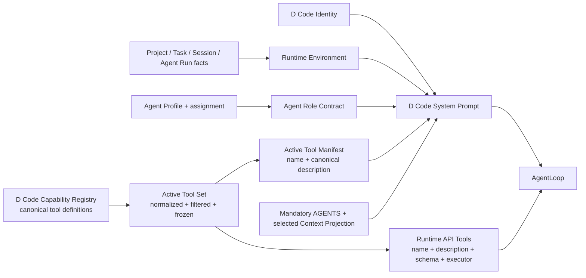

# D Code 系统提示词与活动工具同源边界

状态：Accepted（已接受；`0.0.28` Host 已形成实现候选，原生人工验收与真实认证交接仍由版本 PRD 记录）

## 背景

Pi SDK 默认把模型定义为“运行在 Pi 中的 coding assistant”，并在默认 System Prompt（系统提示词）里加入 Pi 文档入口、工具摘要、项目上下文、Skill 与当前工作目录。D Code 已经确定为以 Pi SDK 作为首个 Agent Runtime 的独立 ADE；继续沿用 Pi 身份，或只在其后追加一句 D Code 品牌说明，会让模型误解自己所处的产品、对象权威、会话语义和能力边界。

`0.0.28` Host 已通过 D Code Prompt Assembler（提示词组装器）显式建立 D Code Identity、运行环境、角色合同、选中一等项目文档 / Context Projection 与 Active Tool Manifest；它完整替换 Pi 通用身份，且只从实际注册的 Active Tool Set 生成工具说明。Pi Resource Loader 仍是 Runtime Adapter 的资源发现机制，但 Pi 默认身份、Pi `SYSTEM.md` / `APPEND_SYSTEM.md`、默认文档入口与未选择的全量上下文不得静默进入 D Code Prompt。

## 决定

1. D Code 拥有每个 Session Run 的 D Code System Prompt；该 Session Run 属于某个 Agent Run 时，提示词带入对应 Agent 角色合同。它完整替换 Pi 的通用身份、Pi 文档入口和默认能力叙述，不采用“Pi Prompt + D Code 追加说明”的双重身份。
2. 每次运行的系统提示词至少由四部分组成：
   - **D Code Identity（D Code 基础身份）**：说明 Agent 正在 D Code ADE 内工作，D Code 拥有 Project、Task、Session、上下文与能力合同，Pi SDK 只是在该轮实际使用的 Runtime Adapter。
   - **Runtime Environment（运行环境）**：说明当前 Project、Task、D Code Session、Session Path、Agent Run、执行目录或 worktree、当前模式、模型运行事实，以及本轮加载的一等项目文档与 Knowledge 来源引用。未知事实必须明确缺失，不得猜测。
   - **Agent Role Contract（Agent 角色合同）**：说明 Agent 当前是 Coordinator、Explore、Worker、Verifier 或其他已定义角色，本轮目标、职责、范围、完成信号、停止边界和回报对象。Coordinator 负责面向用户协调与综合；成员只承担有界工作，不替 Coordinator 或用户宣布 Task 完成。
   - **Active Tool Manifest（活动工具清单）**：列出本轮真实可调用工具的名称和 canonical model-facing description；完整输入 schema 继续由模型工具 API 提供，不在提示词中手写第二份容易漂移的 schema。
3. Pi SDK 内置工具、Pi / 其他来源的已适配扩展、D Code 自有 Capability 与 Provider 工具都必须先归一到 D Code Capability Registry 的 canonical tool definition，再经模型支持、启用范围和本轮运行边界过滤，冻结为一次 Session Run 的 Active Tool Set。任何来源都不得绕过该集合直接注册进 Agent Loop。
4. 每项 canonical tool definition 只保留一个 canonical model-facing description，由 API Tool 与 Active Tool Manifest 直接复用或确定性派生；可选 prompt guidelines 只补充选择和使用规则，不得扩大输入 schema、执行器或实际能力。名称、说明、输入 schema 或执行器缺失的工具不得激活。
5. Runtime Adapter 从同一个 Active Tool Set 生成模型 API Tools 与 Active Tool Manifest；两者的工具名集合必须完全一致。Prompt 只能描述本轮已经注册的 Active Tools，不能授权工具、创造未注册能力或把安装状态伪装成可调用状态。模型或 Provider 不支持真实工具调用时，对应工具既不能进入 API Tools，也不能出现在 Manifest。集合变化时，D Code 必须在下一安全运行边界重建工具定义和提示词，并新增不可变生效记录，而不是改写历史。
6. 当前目录作用域适用的 Agent Instructions（`AGENTS.md`）是强制 Context Projection：每个 Agent Run 建立及每个 Session Run 启动前都必须解析并加入来源路径与 revision。工作目录作用域变化只标记下一 Session Run 需要重新解析，已经开始的 Run 保持原规则快照。其他一等项目文档、Knowledge、历史消息和摘要不属于稳定基础身份，只按 Task 需要有界、可追溯地加入；D Code 不静默继承 Pi 发现的全量项目上下文。
7. D Code Runtime Adapter 必须显式阻断未经选择的 Pi 系统提示词来源与追加项，包括 Pi 默认身份、Pi `SYSTEM.md` / `APPEND_SYSTEM.md`、默认 Pi 文档入口和隐式全量上下文。当前工作目录与适用 `AGENTS.md` 始终作为运行环境和强制 Context Projection 进入；Skill 与其他项目文档只有经 D Code 本轮显式上下文组装后才进入。
8. 每次 Session Run 真正启动 Agent Loop 前，由 D Code Product Store 保存一条不可变 Effective Prompt Receipt，包括模板版本、有效提示词 hash、Active Tool Set revision 和角色 / 环境 / Context Projection 来源引用。只有 Effective Input、Session Run 与回执在同一运行事务中持久化成功后才能发出对应模型请求；一个 Agent Run 可以按时间引用多条回执，后续 Session Run 或安全边界上的工具变化不得覆盖旧 hash 或旧工具集合。回执用于解释系统输入，不证明 Provider 接受或 Run 完成，也不得包含凭据正文、隐藏 Thinking 或不必要的完整敏感上下文。
9. D Code 基础身份由所有 Agent 共用；环境、角色、任务范围与工具集合按 Run 组装。协调智能体与成员智能体不是不同产品 Runtime，也不建立第二套 Agent Loop。

图中最重要的是：所有工具来源先收敛为同一个 Active Tool Set，模型可见说明和真实可调用工具再从中同源生成；提示词不能单独创造能力。

## 影响

- `0.0.28` Host 已在 D Code Runtime Adapter 中建立自有 Prompt Assembler，并为身份替换、Pi 继承项阻断、角色差异、环境事实与工具集合一致性加入自动测试；该结果仍不替代原生人工验收或真实认证 Provider 交接。
- Pi SDK 当前的 `systemPromptOverride` 可以去掉默认身份，但仍可能追加 append prompt、project context、skills 与 cwd；D Code 必须显式接管这些继承项，或在每轮启动边界提交最终有效 System Prompt，不能只依赖一个静态 override。
- Coordination Session 与 Child Agent Session 共用 D Code 基础身份，但分别获得 Coordinator 或成员角色合同和各自 Active Tool Set。
- 工具说明进入 System Prompt 是发现与选择能力，不取代模型 API 的结构化 schema，也不改变 ADR 0005 的“真实注册才可调用”边界。
- 用户界面后续应能够按 Session Run 解释某个 Agent Run 先后使用了哪一版身份、角色、环境来源和活动工具集合，但默认不展示完整系统提示词或敏感正文。

## 未选择的方案

- **继续使用 Pi 默认 System Prompt**：模型身份和产品对象所有权错误，D Code 会继续退化为 Pi 客户端。
- **在 Pi Prompt 后追加 D Code 说明**：形成两个相互竞争的身份与工具叙述，无法判断冲突时谁优先。
- **手写固定工具列表**：安装、启用或运行路由变化后必然与真实工具漂移，重现历史也不可靠。
- **只在 Prompt 中声明工具**：模型 API 没有真实 schema 与执行器，无法调用且会制造虚假能力。
- **把全部项目文档放进 System Prompt**：混淆基础身份和任务上下文，制造噪音、隐式注入和无法解释的上下文变化。
