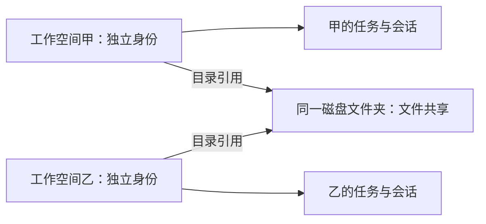
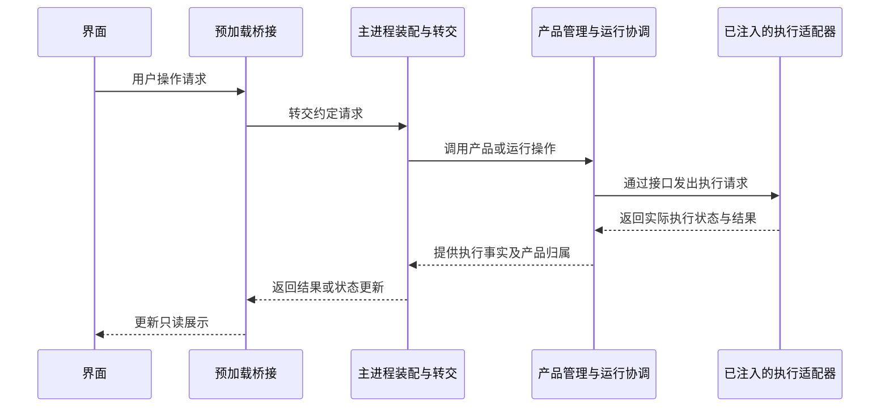
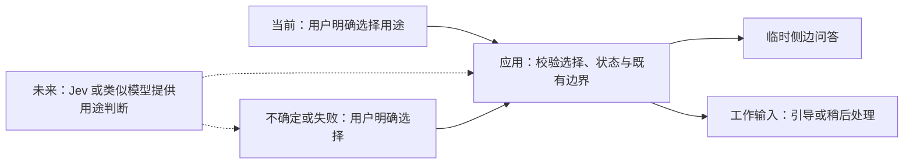

# 客户端起步阶段的架构约定

状态：2026-10-03 工程准备与文字架构范围。507 已确认 Electron + React + Tailwind v4、Pi SDK 1.0.0，以及先建立自动架构检查再开发首批产品功能。独立 UI 工作树已有模拟客户端，本文件所约定的真实 Pi 运行接入尚未实现和验收。

## 用户路径与边界

首条路径以 [开发任务规格](../spec/开发任务路径.md) 为准：需求输入、执行反馈、文件差异与追问在同一工作台完成。导航只改变界面位置；任务重开后等待用户显式接续。界面可以保存草稿和布局，不能自行推进第二套执行状态。

## 模块职责

以下根目录是首批客户端代码的归属约定；尚未有代码的模块不为占位创建空实现。机器可检查的依赖方向、公开入口和外部依赖许可清单统一在 [architecture-policy.json](../architecture-policy.json)，本文件不另维护第二份依赖表。

| 根目录 | 职责 | 对外约定 |
|---|---|---|
| `src/contracts/` | 界面与应用之间共享的操作、结果及只读视图类型；不包含宿主或运行实现 | 从公开入口引用，保持可序列化的边界；具体字段按实现范围设计 |
| `src/renderer/` | React 时间线、侧栏、检查器和设置；管理界面草稿与选择 | 读取视图、发出请求；不引用 Electron、Node 或 Pi 实现 |
| `src/preload/` | 通过 Electron 的隔离桥向界面暴露有限操作 | 只暴露约定方法，不能把原始 IPC 或任意宿主能力交给界面 |
| `src/main/` | 窗口生命周期、IPC 接线与依赖装配 | 连接应用和适配器；不以窗口对象承担任务业务状态 |
| `src/application/` | 工作空间、任务、会话归属及运行操作协调；定义所需适配接口 | 依赖接口，接收注入的适配器；不反向引用具体实现 |
| `src/adapters/mock/` | 原型使用的模拟执行器 | 实现应用定义的执行接口，状态展示始终注明未接 Pi |
| `src/adapters/pi/` | 将相同执行接口接到 Pi 1.0.0 | 不与模拟适配器互相调用；执行事实以选定的 Pi 入口为准 |
| `src/adapters/storage/` | 本地持久化与文件访问实现 | 产品部分通过接口使用，不从界面直接读写 |

模拟适配器与 Pi 适配器的目标是承接同一产品操作约定；一次运行只装配其中一个。Kimi 当前模拟 `ExecutionAdapter` 的同步 `void` 加回调形状不等于真实 Pi 合同已经定案；异步接收、持久化回执、取消、暂停与恢复须依据选定入口设计和验证，届时同步调整消费者。具体进程隔离、存储布局和 Pi 会话映射仍需接入设计，不从上述目录推断成已定方案。公开入口默认使用各模块的 `index.ts`，实际需要变更时连同依赖使用点一起审查。

运行协调负责转交操作和组织结果，执行状态所有者负责确认同一次运行的实际事实，两者不是同一职责。真实 Pi 接入后，已接收输入、回答、工具结果及运行进度以选定 Pi 入口为准；应用层可以保存其只读投影或缓存用于时间线展示，不能借此再次正式接收同一输入或独立推进另一份执行历史。当前模拟原型由应用层汇集并保存模拟时间线，不因此自动构成真实 Pi 的双写，也不据此确定真实 Pi 的所有者边界。审查须追踪实际写入和回执通路，不能仅凭数据副本或回调返回类型判定冲突。

允许引入适用的纯界面依赖时，将实际包名加入 renderer 的外部依赖清单，并保留来源及许可记录；不因此放宽宿主能力或跨模块访问边界。规则、例外及排除路径的修改必须有本轮范围和审查依据。

客户端自有运行代码的文件与网络操作，包括初始化，统一使用异步接口；处理等待与失败，持久化完成后才报告保存成功。该要求不把离线检查和构建脚本强制改为异步，也不授权修改 Pi 等第三方内部实现。现有导入检查不证明所有操作均为异步或不会阻塞，需结合代码审查、静态规则和实际响应验证，不能用“已调用异步接口”代替运行证据。

## 工作空间身份与目录引用

507 已确认多个工作空间可以引用同一文件夹。产品身份因此与目录路径分开：任务归属、空间相关记录和请求关联使用工作空间身份，不以相同路径将不同空间去重为一个对象；实际文件访问、命令工作目录和 Git 操作使用对应的真实目录。目录的规范化与共享写入冲突检测由工程设计处理，不能依靠不同工作空间身份假定磁盘资源已经隔离。当前不引入参考项目的远程身份、跨 Host 路由或路径替代身份的回退格式。

图示为已确认的产品关系，尚非存储或运行验证；创建和引用关系由应用层负责，文件访问由既有适配接口承接，不新增一套工作空间执行器。

## 请求与结果的职责时序

下图描述已约定的逻辑职责，不决定 IPC 消息格式、具体进程数或 Pi API。主进程负责装配与转交，应用部分拥有产品组织状态，执行事实由一次运行中选定的执行适配器所连接的执行端提供；界面保有自己的草稿和展示状态。当前原型使用模拟适配器，真实 Pi 路径尚未运行验证。

这是一次执行操作的通路，纯导航不进入执行操作路径。暂停、恢复、成员授权等待与失败处理的具体状态和分支需在对应方案中补图，准确覆盖时可以复用；绘图要求以 [AGENTS](../AGENTS.md) 为准，不用本图冒充这些行为已验证。

## 自动检查的合同

检查只读执行，解析 JS／TS 源码，依据真实解析到的依赖检查：

- 产品源码必须属于声明的模块，不能把未纳入的源码当成通过。
- 跨模块引用只走允许的方向与目标模块公开入口。
- 外部包与 Node 内置模块必须在该模块的许可清单内；界面不能直接引用宿主或 Pi 包。
- 模块引用不能形成文件循环；本轮将类型导入也纳入依赖图。
- 支持静态导入、重新导出、类型导入、字面量动态导入及 CommonJS 引用；无法静态确定的动态引用报告失败。
- 解析失败、内部引用无法定位、通过别名或符号链接逃出范围等情况明确报告，不静默略过。

配置文件、检查工具、测试和构建输出属于明确排除范围；产品源码不得引用被排除的本地实现。外部包内部代码、样式表中的引用、运行时拼装、Worker／资源 URL、eval、IPC 调用语义、Electron 安全配置和 Pi 状态时序不由本检查证明，需另做相应验证。符号链接形式的产品源码暂不支持，发现时直接报告。检查语法和依赖边界不等于类型检查或应用构建；类型导入所指向的声明可能与最终运行文件不同，交付时仍需类型、构建和实际行为验证。

检查器的验证应覆盖合规依赖、禁止方向、绕过公开入口、宿主引用、路径别名、重导出、动态引用、类型导入、循环、无法解析和未纳入模块等场景。合规场景必须通过，故意违规场景必须失败；命令必须返回对应的成功或失败状态。

## 如何使用与判断完成

根 README 登记真实命令。完整门槛由“检查器自身的正反样例”与“当前产品源码检查”组成；无产品源码时明确显示数量为 0，只能证明检查入口可用，不能宣布客户端架构或功能已验收。

Kimi 在独立工作树编写客户端后，每次交付运行该门槛，并通过全量类型检查与 Lint，完成构建及 [AGENTS](../AGENTS.md) 要求的自动化端到端行为验证；场景组织、并行隔离和失败处理也以该规则为准，结构检查不能替代交互验证。缺少入口时先建立真实检查命令，已有失败不能作为通过。主目录与独立工作树集成时重新运行。不能通过删除规则、扩大排除范围或更改测试期望让新增违规消失。

## 依据与尚未验证内容

模块职责依据本项目状态唯一所有者规则及已确认的桌面技术栈设计。Electron 的隔离桥、进程职责和安全设置应在实际壳层实现时对照官方文档及实际配置核验。检查工具使用 TypeScript 官方解析与模块解析 API；不移植 ZCode 检查器或预设其分层。

当前不包含真实模型调用、用户数据迁移、发布配置、自动后台执行或窗口重开后的自动续跑。

## 产品运行层与外部 Harness 参考

2026-10-03 收到 D Code／DeepSeek Harness 的只读调查交接后，继续保留 Pi SDK 1.0.0 底座。这里的 D Code 产品运行层（harness）指现有产品管理、运行协调与适配职责：工作空间／任务／会话归属、成员协调、输入与回执、成员授权、界面生命周期及只读视图。它不表示新增一个与 Pi 并行推进同一次运行的执行器，也不指定新目录、数据库或框架。

| 处理 | 结论及归宿 |
|---|---|
| 吸收为当前职责说明 | Pi 选定执行入口拥有同一次运行的执行事实；D Code 负责产品归属和运行协调，界面消费真实状态。沿用本文件模块表与已有唯一写入者规则 |
| 研究候选 | 普通 Pi Extensions、Codemode 与能力包治理分别研究，不能把整个产品管理塞进扩展，或让工具组合脚本成为第二个调度器。普通 SDK 与 Durable 的兼容未知统一见 [Pi 能力核对](Pi-1.0.0-虚拟模型与运行恢复.md#能力包与扩展兼容的接入检查点) |
| 研究候选 | 参考 DeepSeek Harness 的服务依赖、资源生命周期及事实派生视图，检查依赖未就绪、失效、清理与状态回执；按 D Code 实际边界适配，不预先将全部功能插件化 |
| 本轮不采用 | 替换 Pi 为 DeepSeek 运行时、引入 Cordis 或 DSH sessionlog、按参考项目扩展 Web／远控／无界面执行；没有已确认需求支持这些变化 |

原交接的 DeepSeek 引用未固定版本；整合侧本轮实际查询远端 `master`，取得提交 `5badb15009ae1756c3afe0ae0cef1faafc290ccc`，并成功读取该提交原文。固定 [架构说明](https://github.com/deepseek-ai/deepseek-harness/blob/5badb15009ae1756c3afe0ae0cef1faafc290ccc/docs/architecture.md) 描述 Cordis 的可替换服务、持久事件与派生历史；固定 [TypeScript SDK 说明](https://github.com/deepseek-ai/deepseek-harness/blob/5badb15009ae1756c3afe0ae0cef1faafc290ccc/packages/sdk/client/README.md) 列有无 mid-turn cancel 的限制。不据此宣称该 SDK 能直接替代 D Code 的独立暂停与引导合同。

ZCode 第四轮所声称读取的另一固定版本链接，经整合侧实际请求得到 HTTP 404，相关“已核实”摘要未被采用。已将 16 份固定版本 Pi／DeepSeek 原文下载为只读研究副本，并逐文件保存 URL、提交与 SHA-256；ZCode 改读这些原文复核。临时来源清单为 `/var/folders/61/fc0gr9wd52sc59sl32dvqj5c0000gn/T/dcode-reference-review-y14yk3k5/manifest.json`，源码未执行；耐久引用以上述固定 GitHub 链接为准。

交接提供研究依据，不自动增加首版包管理或插件市场需求；实现、运行实验、依赖安装和用户数据变更不由这份文字材料扩权。核心恢复与侧边问答等已确认规则继续以 spec 为准。

## 补充参考的评审边界

507 于 2026-10-04 补充 Raven、Motion Panels、CC-Usage-Band 与多家用量来源的研究交接，并要求对照最新状态评审。执行底座、三层对象、单一执行事实所有者与当前界面生命周期均继续有效；产品运行层是已有产品管理与协调职责，不新增执行循环。参考里的事实声明先核对固定原文和实际接口，不能用候选资料反推已实现能力。

可直接沿用的设计约束：模块声明资源与监听的归属、清理和停机责任；启用意图与实际加载成功分别记录；成员间接调用工具不绕过主会话授权。507 已确认产品不设权限模式，主会话不加产品操作审批；原交接关于审批的参考适配为主会话按分工范围授权成员、成员超出范围时申请及其状态展示，不能重新引入主会话审批卡。具体对象、环境、动作、影响范围与可执行下一步须有真实依据，授权及恢复规则统一见 [主会话与成员授权](../spec/工作台信息架构.md#主会话与成员授权)。并行运行、隔离写入、历史恢复与执行恢复分别验证。

| 评审问题 | 所需证据与最小范围 | 当前处理 |
|---|---|---|
| Pi 组合接入及能力包装配 | 复用已固定源码，核对普通 SDK／Durable 的入口、扩展与工具权限通路；列隔离假数据实验及判据，未经执行不报告通过 | 沿用 [Pi 能力核对](Pi-1.0.0-虚拟模型与运行恢复.md)，不并置执行器，不新建包格式；完整包治理尚非首版要求 |
| Raven 的对象与展示 | 已核指定提交的工作节点类型、依赖与状态字段、图节点选择及画布交互；其余审批、失败和运行尝试按实际源码继续核验 | 507 已确认首版列表／只读协作图切换，并认可会话内示意的阅读方式；正式产品与真实数据未验收。成员授权状态与重试呈现按 D Code 规则适配，不移植主会话操作审批或流程编辑器，不新增顶层工作对象 |
| Motion Panels 是否值得替换现有布局 | 先读当前原型布局找明确缺口，再固定候选版本、核许可及公开接口；确有缺口后才提出隔离验证计划，覆盖拖宽、窄屏、长文本、键盘与布局恢复 | 不安装、不替换、不打断当前原型；React 版本范围符合不等于 Electron 实际兼容 |
| 统一用量的数据与展示 | 核对各官方接口／源码的认证适用范围、区域、窗口、单位、更新时间与字段稳定性；本轮只读主源，不访问用户账户 | 507 已确认首版同时覆盖任务用量及可可靠读取的账户信息，三类指标分别呈现；各服务支持清单、接口选择与实际接入待验证 |

用量展示的现行产品合同见 [用量与账户额度](../spec/用量与账户额度.md)：缺失字段未知、失败不补零，任务 token 不反推账户余额，估算有价格依据且不当作实际账单。已确认范围不代表已经具备用量读取能力。交接所列 MiniMax、Codex、Kimi、Z.ai 的具体端点、认证适用范围、区域、字段与稳定性由调度会话核验；各来源独立适配，不跨区域试发凭据，未核实内容不写成稳定接口合同。

本轮 Raven 图视图证据固定于 `3632e6040c7038a60ec418ce39ccae185c72c19f`：[编排说明](https://github.com/EverMind-AI/Raven/blob/3632e6040c7038a60ec418ce39ccae185c72c19f/docs-site/docs/orchestration.zh.md) 描述工作节点的依赖与并行；[节点类型](https://github.com/EverMind-AI/Raven/blob/3632e6040c7038a60ec418ce39ccae185c72c19f/ui-web/src/features/dag/types.ts) 分别记录节点、负责 Agent、可选实例、依赖和状态；[DagGraph](https://github.com/EverMind-AI/Raven/blob/3632e6040c7038a60ec418ce39ccae185c72c19f/ui-web/src/features/dag/DagGraph.tsx) 提供连线与节点点击／键盘选择；[Board](https://github.com/EverMind-AI/Raven/blob/3632e6040c7038a60ec418ce39ccae185c72c19f/ui-web/src/features/dag/Board.tsx) 负责平移、缩放和视图保持。这些是静态源码证据，不是本轮运行验收。

D Code 采用“看清分工、关系与真实状态”的交互思路；示意中的节点、成员和等待状态为模拟内容。图读取已有分工与运行事实，不成为第二个调度器，也不要求 D Code 所有协作必须按 Raven 的固定 DAG 执行。节点不与进程或会话强制一一对应，实际接入仍以 Pi 1.0.0 和现有单一事实所有者规则为准。

## 后续方向：模型辅助输入分流

507 于 2026-10-03 确认当前显式选择输入用途，未来演进为模型辅助自动分流。产品现行行为见 [输入入口与后续演进](../spec/工作台信息架构.md#输入入口与后续演进)。未来方向已确认，具体模型、版本、接入方式与上线时间未定；不纳入当前原型的依赖和交付范围。

Jev 或类似模型可作为意图判断候选。TypeSafe 官方提供意图分流模式，Choice 能返回所选项、各选项概率和置信指标；这支持研究“临时提问／调整工作”等用途判断，但不能直接证明在 D Code 的中英文工作对话中足够可靠。[意图分流说明](https://docs.typesafe.ai/patterns/intent-routing)、[Choice 定义](https://docs.typesafe.ai/primitives/choice)

当前实现保持输入用途与其实际行为的职责清楚，未来分类结果接到同一行为入口。模型只提供用途判断，应用继续拥有用户选择、当前状态和权限校验，不能由模型直接改派工作、解除暂停或绕过既有操作边界。用户明确选择优先；判断不确定或服务失败时退回可用的手动入口，不阻塞基本交流。无需为此提前增加空适配器或厂商依赖。

上述图仅说明当前路径与未来候选的职责关系，尚非接入实现。启用自动分流前，使用代表性中英文输入验证：纯查询、明确纠正、混合意图、依赖上文的短句及运行状态变化。重点核对把查询误作执行要求的情况，并实测整体延迟、成本、用户改选和失败回退。置信指标概括选项概率的分布，不是正确性或行动授权的证明；阈值由本项目样例验证，不照搬文档示例数值。[置信度说明](https://docs.typesafe.ai/confidence)

本次仅核对公开资料，未安装 TypeSafe SDK、配置凭据、调用模型或验证分类效果。
