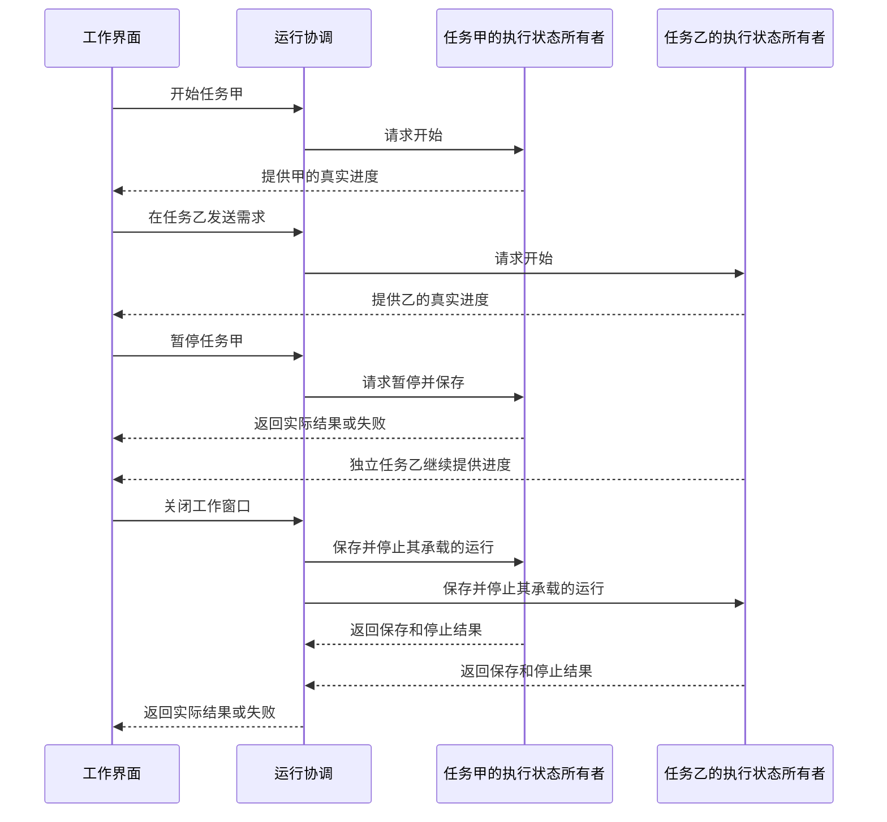
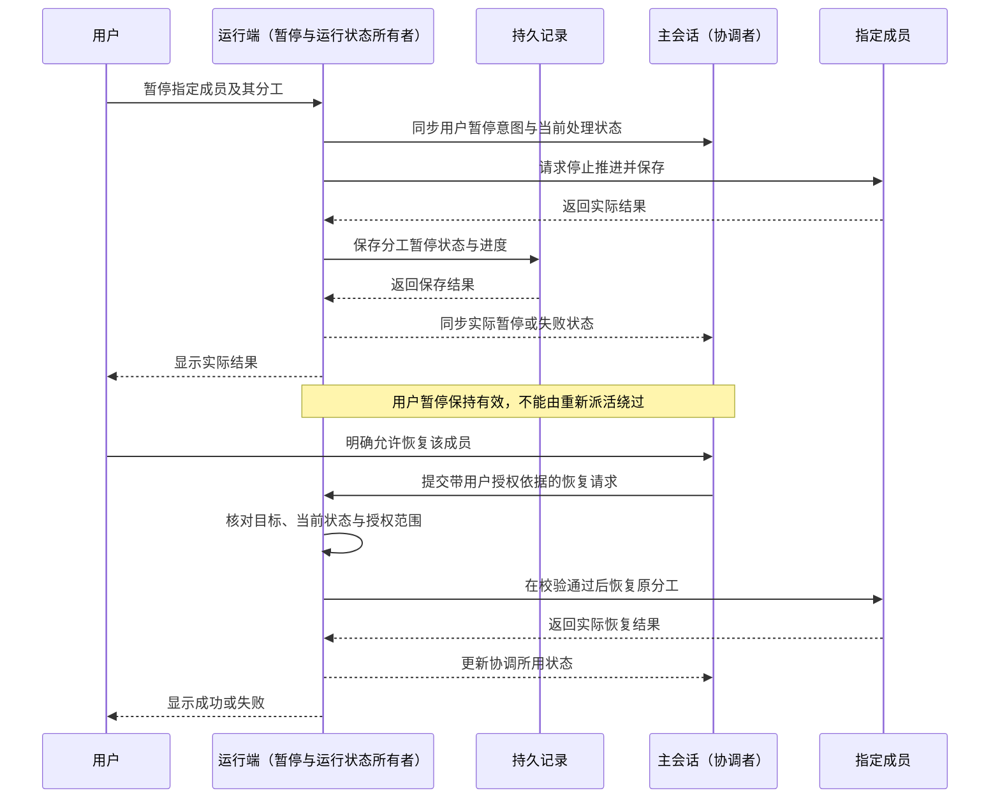

# 任务暂停与恢复

状态：产品边界已确认，交互和接入未完成。依据：507 于 2026-10-03 确认关闭界面后停止推进、保存状态，重开后显式接续；随后确认不同任务可以并行推进，以及用户暂停成员分工、主会话获知并在明确授权后恢复的规则。独立工作树的模拟原型仍在开发，本文行为未经集成验收，真实 Pi 接入未实现。

## 已确认行为

| 用户动作或状态 | 预期结果 |
|---|---|
| 界面存在并开始运行 | 任务推进，用户能够观察执行状态 |
| 暂停任务 | 任务停止推进，保存能够接续的运行状态 |
| 关闭承载运行的工作界面或退出应用 | 停止任务推进并保存状态；当前不提供界面关闭后的持续后台执行 |
| 再次打开 | 找回已保存状态，执行不自动继续；会话顶部恢复条由用户显式接续，不要求重新交代全部任务 |

当前排除关闭界面后任务仍独立在后台持续运行。这个范围适用于主会话及其关联执行，不能借成员会话或后台服务绕过。

“界面存在”不在本规格中扩写为“必须始终处于前台或选中当前会话”。第二轮已确认侧栏折叠、切换会话、开闭检查器、进出设置均为纯导航，不能改变执行状态。重新显示工作状态和恢复执行是两个动作，重开后必须由用户显式接续。最小化等尚未单独定义的窗口动作仍按已确认生命周期设计，不从选中状态推断运行状态。

## 不同任务并行推进

507 已确认：任务甲执行时，用户可以到任务乙发送需求，让两项任务同时推进；不将整个应用设计为一次只能推进一项任务的全局串行队列。用户能够分别查看执行状态，暂停或恢复任务甲不连带改变独立任务乙的执行状态。并行不表示无上限，资源与共享文件冲突的处理仍需工程设计和验证。

关闭承载这些运行的工作窗口或退出应用时，停止其范围内的运行并保存；重开先呈现已保存状态，等待用户显式接续。并行能力不改变上述界面生命周期边界。任务级暂停覆盖该任务的主会话与关联成员执行；独立任务不受连带影响。用户单独暂停成员时按下节处理，不能将两种暂停范围混同。

下图是用户操作与状态所有者的职责约定，非已实现证据；任务甲、乙的执行端各自提供实际运行结果，运行协调只转交操作，界面不自行宣告执行完成。

## 用户暂停成员分工与授权恢复

507 已确认：用户单独暂停某个成员时，该成员及其承担的这份分工一起暂停。保留分工、上下文和已保存进度，等待用户恢复或明确调整；其他独立分工可以继续。主会话不得因认为这份工作仍需完成，就自行换成员、另开会话或重新派发相同分工来绕过用户暂停。

暂停是需要主会话获知的协调事件。运行端记录用户暂停的目标与当前真实结果，向主会话同步“用户主动暂停了哪位成员、哪份分工，当前是暂停处理中、已暂停还是失败”。主会话后续协调必须读取并遵守该状态，不把用户暂停误作成员失败或可自动恢复的等待。通知尚未送达或主会话尚未处理时，界面如实显示；通知失败或重试结束也不解除用户暂停约束，不能仅靠一条自然语言通知维持该约束。

普通派工、引导和“稍后处理”都不能绕过用户暂停继续执行。暂停期间新输入是否接收，须以实际接收结果为准；当前不把“不能唤醒”扩写为所有新输入都必须进入持久队列。无论是否接收，已有暂停约束持续有效；输入未接收时保留原文及失败反馈。

用户随后可以在主会话的工作输入中明确允许恢复该成员。恢复意图与对象在当前上下文中明确时，主会话可发出恢复请求，无需强制用户返回成员页面重复操作。此处“重启”指接着原分工和已保存状态继续；是否需要重新发起在途模型请求，仍遵守本规格的能力边界。

运行端核对当前暂停状态与用户授权的对象和范围，再执行恢复；只有取得实际结果才更新为已恢复。目标仍暂停且恢复失败时，保留暂停及可回查记录；目标已不存在或已恢复时返回真实结果，不虚构暂停，也不因重复请求再次启动同一工作。普通进度询问、侧边问答、成员求助或主会话自行判断不能代替用户恢复授权；用户再次暂停后，先前的恢复请求不能解除新的暂停。整个任务仍处于暂停时，单成员恢复也不能绕过任务级暂停。

以下是职责和先后约定，不是已实现的接口或 Pi 运行证据。

## 能力边界与失败处理

- 保存和接续指任务运行状态的恢复，不承诺冻结并原样续接任何模型供应商的同一次推理。普通模型请求中断后的重新发起、已保存部分回答及工具调用恢复需要分别处理，依据见 [Pi 1.0.0 能力核对](../doc/Pi-1.0.0-虚拟模型与运行恢复.md)。
- 已完成的结果、在途调用和未开始的工作必须能够区分；不能把未知结果当成成功，或为接续任务盲目重复有副作用的动作。
- 保存失败时不能显示为已安全保存；恢复失败时保留可恢复记录，并说明当前状态与可继续的操作。具体交互随页面设计补齐。

## 后续验收场景

以下为根据确认边界整理的验证要求，当前均未执行：

1. 正在运行时暂停，确认任务停止推进、已完成结果保留，并能继续。
2. 正常关闭工作界面或退出应用，确认不再推进任务；重开后展示已保存状态并等待用户，只有显式接续才恢复执行。正常关闭与强制终止后的恢复分别记录验证结果。
3. 分别在模型请求、工具执行及等待后续步骤时暂停和恢复，核对中断状态、请求重发与工具副作用，不用同一“恢复成功”掩盖不同结果。
4. 模拟保存或恢复失败，确认没有虚假的“已保存／已恢复”状态，且已有记录仍可回查。
5. 任务甲运行时进入任务乙并发送需求，确认两项任务均能推进；来回导航不暂停任何一项，分别展示正确归属的进度与结果。
6. 两项独立任务运行时暂停甲，确认甲停止并保存、乙继续；恢复甲不重复启动乙。关闭工作窗口后两项均停止推进，重开两项均不自动续跑。
7. 暂停一个成员，确认其分工停止推进、主会话获知用户暂停及实际状态；其他独立分工继续，主会话没有另行派人执行被暂停的同一份工作。
8. 在主会话明确允许恢复被暂停的成员，确认目标成员接着原分工继续，主会话与界面反映真实恢复结果；不要求用户重复进入成员页面操作。
9. 分别模拟通知延迟或失败、保存失败、恢复失败以及暂停后收到普通侧问，确认没有虚假通知完成、成功保存或自动恢复；通知失败不解除暂停约束，原始授权和工作记录可回查。
10. 恢复请求尚在处理时用户再次暂停，确认过期请求没有解除新暂停；存在任务级暂停时，成员级恢复没有绕过整体边界。
11. 对被暂停的分工发送普通派工、引导或稍后处理，确认都未绕过暂停；分别按实际结果显示接收或未接收。重复恢复请求或目标已不存在时，返回真实状态，不重复启动、不制造虚假的暂停状态。

## 实施前需完善

UI／UX 已确认恢复条与显式接续；后续细化暂停与关闭的反馈，并验证运行所依附的窗口范围。工程设计负责暂停粒度、在途工作收束、状态写入唯一所有者、持久化时序及 Pi 接入验证。应用异常退出的恢复保证另行核实，不把正常关闭可保存推断为任意崩溃都能无损恢复。客户端技术栈已确定为 Electron + React + Tailwind v4；具体执行进程、持久化时序和接入仍需验证，不引入后台常驻执行。原型以模拟适配器完成的保存与重开只能证明原型行为，不能作为 Pi 已接入的证据。
