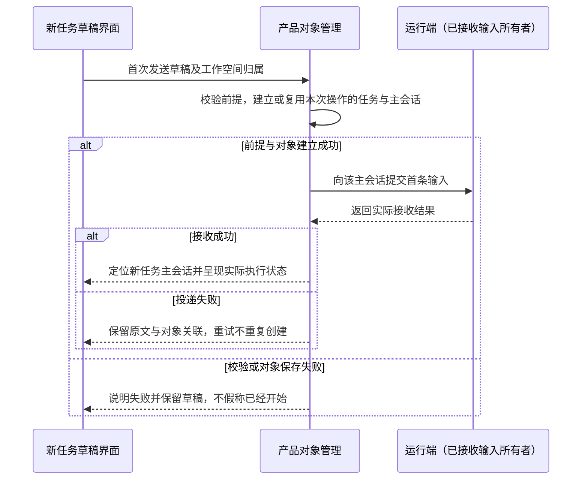
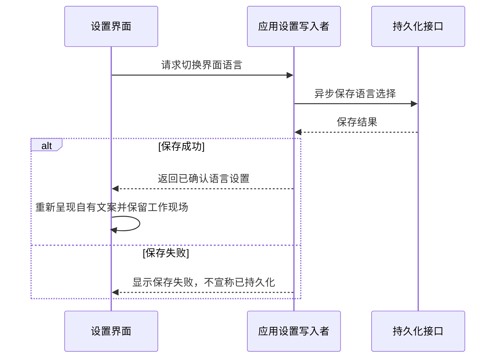

# 冷启动与草稿态

状态：第二轮场景已有独立模拟原型记录；507 于 2026-10-03 随后确认的新草稿创建独立任务行为尚未实现和验收。本文负责打开应用后的界面落点与草稿入口，承接 Kimi 两轮交接及后续确认；运行暂停与接续由 [任务暂停与恢复](任务暂停与恢复.md) 负责。

## 要解决的问题

507 打开 D Code 后应能找到正在进行的工作，或立即开始交代新的开发需求。首屏观感、输入主次与下一步操作都以 [开发任务路径](开发任务路径.md) 验证，沟通路径作为其子集。

## 已确认行为

### 冷启动

设置提供两档，并记住用户选择：

| 设置 | 打开后的界面结果 |
|---|---|
| 恢复上次现场（默认） | 有可恢复记录时，恢复上次工作空间、任务和会话所在的工作现场 |
| 固定 Home 新草稿 | 进入 Home 工作空间的新任务草稿入口；首次发送时建立独立短期任务及主会话，已有工作仍可从侧栏进入 |

恢复现场包括工作空间、任务和会话选择、树展开、侧栏及检查器几何、任务信息面板显隐、分组展开与几何、主题、字号、界面语言与草稿文本；会话滚动定位到最新底部。hover（悬停）、动画中间帧和流式中间帧不作为界面现场恢复；已持久化的执行记录仍由执行端真实恢复。重开后执行不自动继续，用户通过会话顶部恢复条显式接续；不改变当前排除无界面后台运行的范围。

临时侧问历史不纳入退出重开的恢复范围，其本次使用期间保留及显式转为工作输入的规则见 [侧边对话](工作台信息架构.md#侧边对话了解工作而不改变执行)；已转入工作输入的内容继续按该工作输入的草稿或接收状态处理。

### 草稿态

新任务草稿态指用户尚未正式发出一项新工作的首条消息时的输入界面。507 已确认：从 Home／当前工作空间的新草稿发送首条需求时，建立一个新的短期任务及其主会话，这条需求成为主会话开头；不自动并入默认任务的既有主会话。

发送前，草稿关联当前工作空间保存，打开草稿、输入文字或进入设置不产生一个正式任务。首次发送后，任务与主会话具有明确归属，不出现游离会话。主动打开内置默认任务仍可进行杂事和持续交流；在已有任务或成员会话继续输入，仍作用于该会话，不重复创建任务。

- 使用满版内容区组织元素；Composer（输入区）是视觉主角，动态问候使用小字弱化呈现。
- 有历史时，以“继续”区为主要辅助行动，呈现 3–5 个近期任务入口，推荐动作为辅。实际不足 3 项时仅显示真实记录，不填充虚构任务。
- 无历史时，推荐动作成为主要辅助行动，引导用户开始工作。
- 不使用 WebGL 类装饰场景。高密度、字号与几何、主题和品牌遵守 [DESIGN](../DESIGN.md)。

首次发送先核对配置与工作空间，再建立任务／主会话并投递输入；只有实际接收结果成立后才显示已发送并清理对应草稿。校验或保存失败时保留原文和可继续操作的状态。对象已经建立但输入投递未成功时，保留明确的待发送状态，重试复用原任务与主会话，不能重复建任务、重复发消息，或把消息误投默认任务。

每次首发操作须能关联并回查任务／主会话的建立结果与执行输入的接收结果，重试沿用该关联；不能仅因文字相同就把不同发送操作合并。该关联的生成位置与持久化方式由工程设计负责，不要求界面自行维护另一份正式输入队列。

下图说明产品归属与执行输入的所有者，不指定数据库布局或跨存储事务实现；各阶段须能按同一次首发操作关联和回查。

### 缺模型配置

- D Code 本地优先，不设置产品账户登录墙，也不设置引导向导。
- 首次缺模型配置时，在草稿态内联提示并提供设置入口；模型服务所需的配置或认证与产品账户登录分开。
- 配置提示、实际输入与开始执行的状态要清楚区分；不能在缺少必要配置时假装任务已经执行。配置保存并满足必要配置要求后，内联提示自动消失；保存失败不显示为配置完成。

## 已确认的交互收口

- 首次没有现场记录时进入 Home 工作空间的新任务草稿。原目标移动后，定位到对象当前归属；对象已删除或无法定位时回 Home 新任务草稿，并以内联说明告知，不虚构恢复成功。
- 设置是主区内的页面，侧栏保持可见。新任务草稿按工作空间及草稿身份保存，既有会话的输入草稿按会话保存；进入设置不会丢失输入，返回原草稿或会话时恢复对应文字。通过侧栏任务、设置页“返回”或 Esc 回到工作；设置页 Esc 仅负责返回，不能同时触发停止或暂停。
- 近期任务点击仅导航到该任务最后一条会话，不触发执行；推荐动作点击只把文本填入输入区草稿，等待编辑和发送。
- 侧栏折叠、切换会话、展开或隐藏任务信息面板及其分组、开闭检查器及进出设置均为纯导航，不改变执行状态。发送工作输入、停止、暂停／恢复属于影响关联工作执行的用户操作；成员授权由主会话处理，不设置用户操作审批入口。侧边问答不改变该工作的执行状态，具体边界见 [工作台信息架构](工作台信息架构.md#侧边对话了解工作而不改变执行)。执行端自然产生的进度与结果仍据实显示。
- 恢复树展开时遵守同一时刻只展开一个任务会话列表的规则；恢复目标无效的处理不允许产生游离会话。

## 双语设置与恢复

首版提供中文／英文切换，保存用户的界面语言选择，重开后恢复该选择。切换时保留当前空间、任务、会话和草稿，不发送消息、不暂停或恢复任务；界面文案重新呈现，用户内容和原始执行记录保持不变。双语共同排版要求见 [DESIGN](../DESIGN.md)。

以下是偏好更新的逻辑约定；实际接口和语言初始化策略由实现设计明确，当前尚无运行验收证据。

接收设置更新不能再次触发相同写入或广播。翻译缺项及保存失败需要可见诊断，不能以改写用户内容补足翻译。

## 验收场景

以下为当前规格的验收要求；第二轮原型已有场景的证据不自动覆盖本次新草稿归属变更。新建任务与失败重试的新增路径仍未验证，与对象归属相关的场景同时遵守 [工作台信息架构](工作台信息架构.md)。

| 准备条件与操作 | 要验证的结果 | 证据边界 |
|---|---|---|
| 有上次现场，使用默认启动设置重开 | 找回约定的位置、几何和草稿；滚动到底部；运行等待显式接续 | 界面恢复与真实运行恢复分别记录 |
| 选择固定 Home 新草稿，重开应用 | 显示 Home 新任务草稿；未发送不创建任务，原工作仍可找到 | 设置读回与对象数量、侧栏操作验证 |
| 有真实近期任务，打开新草稿 | 输入区最突出，继续区为主、推荐为辅；入口能定位对应任务 | 原型验证主次，实际应用验证入口归属 |
| 没有历史，打开草稿态并点击推荐动作 | 进入 Home 新任务草稿；推荐文本填入但不发送，不创建任务或虚构近期任务 | 操作前后记录草稿、对象数量和执行状态 |
| 从新任务草稿发送首条需求 | 在对应工作空间建立一个短期任务及主会话，原文成为首条输入；默认任务既有上下文未混入 | 核对任务数量、归属、主会话历史及接收结果 |
| 首次发送失败后重试，或同次发送尚未结束时重复点击 | 原文保留；回查并复用已建立的任务和主会话，没有重复任务或重复输入 | 分别覆盖前提校验、对象保存、输入投递失败及接收成功但回执未到达 |
| 主动进入默认任务，或在已有会话继续输入 | 继续该任务／会话的上下文，不因为发送而自动新建短期任务 | 对照入口与消息归属验证 |
| 首次未配置模型，已有草稿，进入设置后返回 | 内联提示引导配置，草稿保留；保存成功提示消失，失败仍显示实际结果 | 侧栏／返回／Esc 三个返回入口分别操作验证 |
| 原现场对象已移动、删除或记录不可用 | 可定位时进入当前归属；不可定位时回 Home 新草稿并内联说明 | 分别保留移动和删除场景的界面与归属证据 |
| 中文／英文，13px／14px，浅色／深色及不同窗口尺寸 | 两种语言的输入、继续入口和配置提示清楚可用，无截断或遮挡主要操作 | 用真实中英文文案实际渲染与操作；当前没有视觉验收结论 |
| 有草稿和执行状态时切换语言，再重开 | 语言选择保存，草稿和归属保留，执行仍遵守显式接续规则 | 端到端验证切换与读回；不把模拟器结果当作真实 Pi 恢复 |

客户端采用已确认的 Electron + React + Tailwind v4。本规格不定义成员协作、任务归档／置顶或图标库，模拟适配器结果不能代替真实 Pi 恢复证据。
