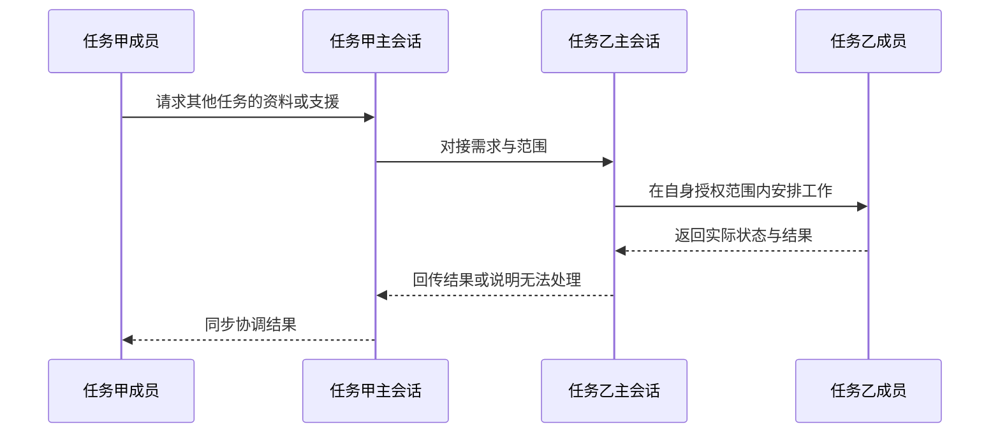
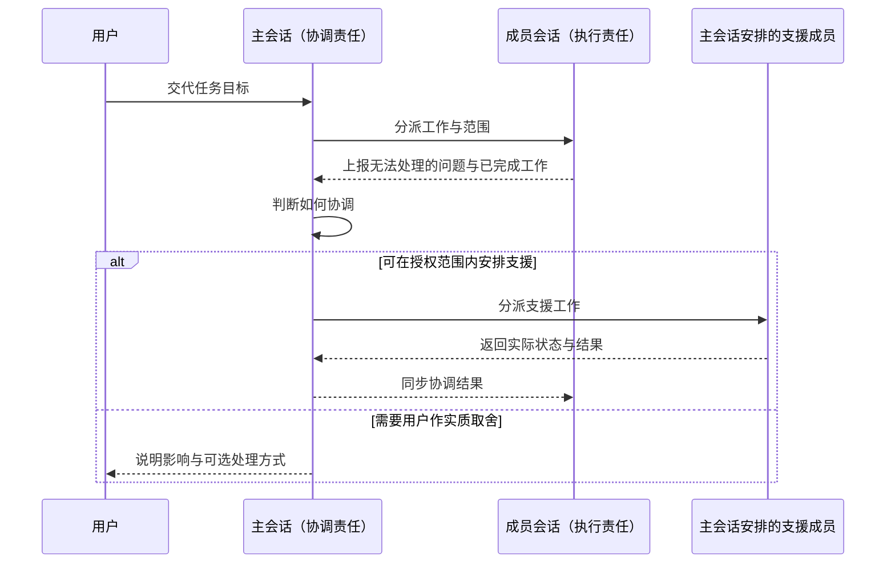
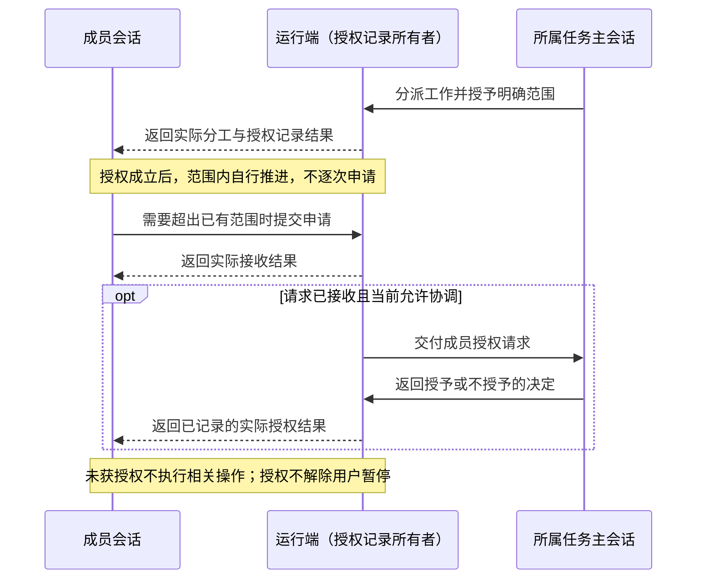
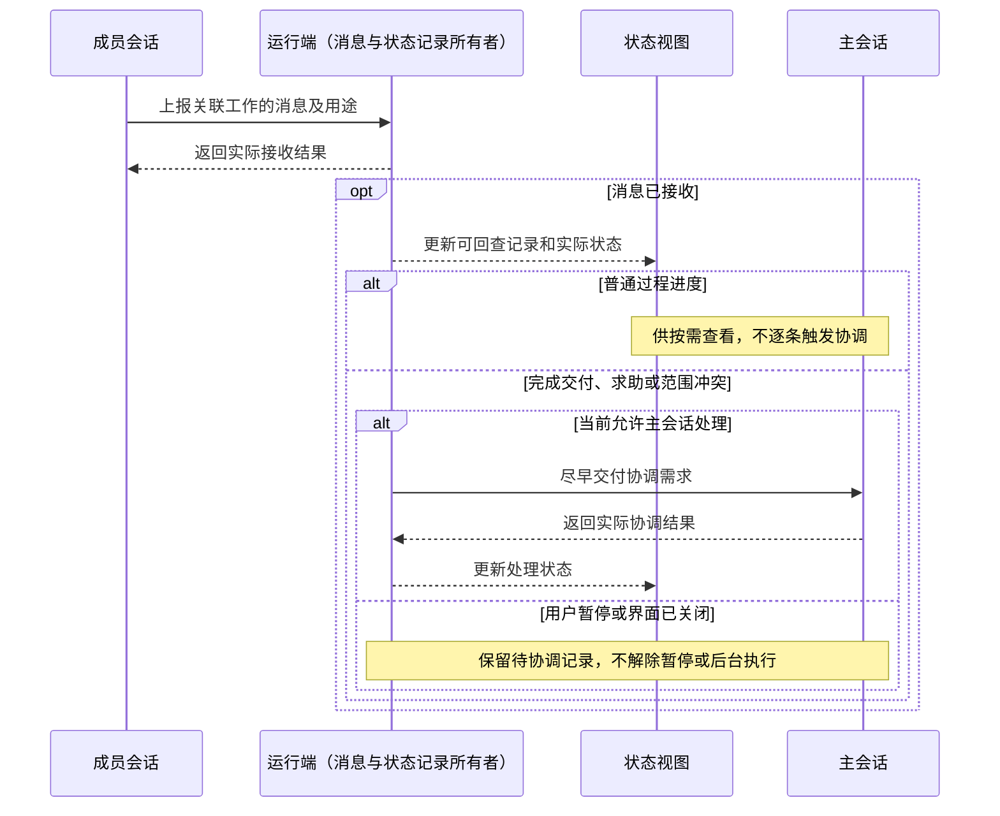
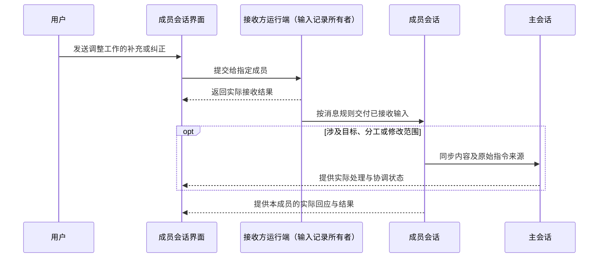
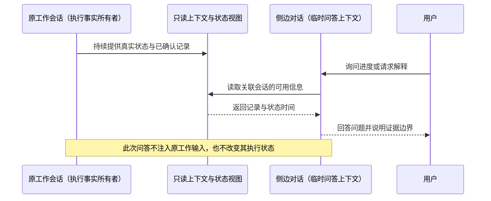
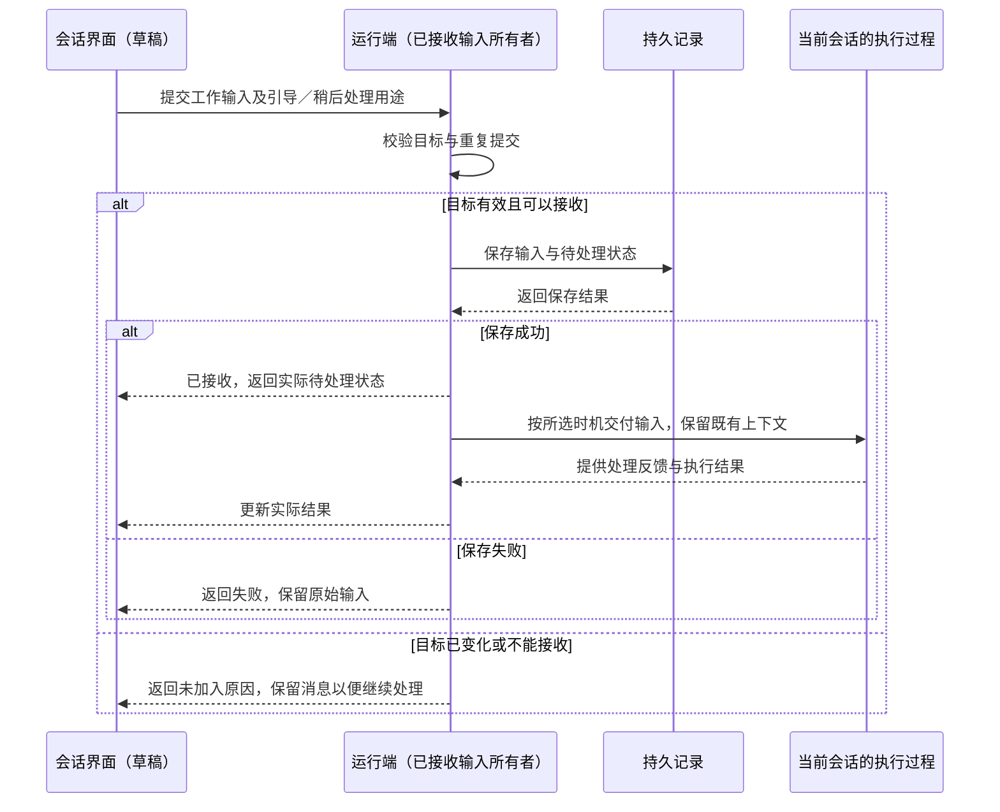

# 工作台信息架构

状态：已确认范围与验收草案，尚未完成集成验收；协作权限与界面映射为后续新增确认，未实现。依据：507 于 2026-10-03 同步的 Kimi 四分支最终交接及随后关于内部会话团队的确认；文件夹绑定细节已回查同一会话中 507 对“其一”的确认。本文件统一承接工作台导航与对象树，不另建平行规格；词义见 [GLOSSARY](../GLOSSARY.md)。

## 目标与验收路径

让 507 能在清楚的工作位置开始和继续任务，并在多项工作之间切换而不丢失归属。按 [开发任务路径](开发任务路径.md) 验证：新建任务、进入会话、观察执行、检查文件差异、继续追问；同时覆盖默认环境和跨空间移动。

## 对象与归属

- 主干为工作空间 → 任务 → 会话，不保留独立的“项目”层级。
- 工作空间支持多个工作文件夹，每个空间内置不可删除的默认长期任务，承接杂事和临时沟通，并可在其中新建短期任务。文件夹提供工作范围与默认目录；具体工具授权和访问边界需由工程设计核实，不能仅凭目录绑定宣称安全隔离已经成立。
- 507 于 2026-10-04 确认同一个文件夹可被多个工作空间引用。各空间保持独立身份、任务和会话归属，不因路径相同而自动合并，也不复制磁盘文件；对共享文件的实际修改在其他引用该文件的空间中同样可见。共享引用不提供写入隔离或额外权限，并行修改仍须协调。
- 同一工作环境内按任务组织不同目标。例如，以 D Code 为工作空间时，“产品开发”和“技术研究”应作为其下的任务，不因工作类型不同就默认拆成两个工作空间。允许多个空间引用同一文件夹是能力边界，不作为引导用户重复建空间的默认组织方式。
- 任务最多两级：长期任务 → 短期任务；短期任务不再嵌套任务。任务直接归属于工作空间，或作为同一空间内长期任务的子任务；不存在无空间归属的任务。
- 每个会话必须属于一个任务。任务内有一条主会话及按需建立的成员会话，会话语义对齐 Pi session（会话）；这不等于已核实 Pi 的子智能体机制与 D Code 成员会话一一对应。
- Home 工作空间以用户主文件夹为根目录，是实际默认空间。“未另选空间”的工作仍归属 Home，不产生游离任务或会话。
- 新任务草稿首次发送时，在当前工作空间建立新的短期任务及主会话；默认任务保留为可主动进入的杂事与持续交流入口。创建时机、草稿保存及失败重试规则以 [冷启动与草稿态](冷启动与草稿态.md#草稿态) 为准。
- 任务可选绑定所属空间内一个文件夹，作为默认工作目录；不绑定时使用空间默认目录，绑定关系可修改。空间默认目录的选择方式及任务嵌套后的目录解析在实现设计中明确，不从旧版恢复隐含规则。

## 导航与移动

- 侧栏采用树形导航。各工作空间是始终可见的根节点，不提供隐藏该层的模式；长列表仍可滚动。不采用工作空间标签页制或系统级多窗口。
- 侧栏可拖宽；新建任务与跨空间移动的入口位于对应树行。
- 展开工作空间查看任务；点击任务行直接进入其主会话，展开任务查看成员会话，成员所在的会话层不再重复列出该主会话。同一时刻最多一个任务展开成员会话列表，切换展开目标时收起前一个列表。长期／短期任务仍遵守既有两级组织关系。
- 507 所说“主会话就是可见的任务层级、成员会话就是会话层级”落实为上述界面映射；任务继续承担组织、目录绑定与移动职责，主会话承担连续交流和协调职责。冷启动恢复与近期任务“继续”入口仍按 [冷启动与草稿态](冷启动与草稿态.md) 定位，不将任务行的默认入口扩大为覆盖所有恢复行为。
- 任务是用户主要浏览层级；导航的折叠和展开不自行定义任务的执行或暂停状态。
- 支持任务跨工作空间移动，会话记录随任务保留，用户能够在新空间接续原工作。移动后按目标空间解析工作目录；失效的历史文件路径引用降级为纯文本，不继续呈现为有效文件入口。
- 移动长期任务时子任务如何随行、绑定目录如何调整，以及移动中的执行状态处理，需要在进入相关实现前补齐。这里不把“无感”扩大为未确认的自动迁移文件或改变磁盘文件内容。

## 验收场景

以下是设计与后续实现必须覆盖的场景，当前均未验证：

| 用户操作或条件 | 要核对的结果 |
|---|---|
| 主动进入 Home 默认任务发起临时沟通 | 继续该默认任务的主会话，不产生游离会话 |
| 从 Home 新任务草稿发出首条需求 | 新短期任务及主会话归属 Home，不将输入混入默认任务 |
| 查看或操作默认任务 | 默认任务保持存在，不提供删除入口；其中仍可新建短期任务 |
| 在长期任务内新建短期任务 | 两级归属清楚，不产生第三级任务 |
| 点击任务行，再展开并选择成员会话 | 任务行打开主会话，展开后可进入成员；列表不重复主会话，成员仍归属原任务 |
| 给任务绑定文件夹，或使用未绑定任务 | 分别使用绑定目录或空间默认目录；界面中的工作位置与执行位置一致 |
| 两个工作空间引用同一文件夹 | 两个空间及其任务、会话保持独立归属，磁盘文件未复制；共享文件的实际改动一致可见，不误报已经隔离并行写入 |
| 在 D Code 工作空间分别建立产品开发与技术研究任务 | 任务在同一空间中组织，不自动另建工作空间或复制文件夹 |
| 展开另一个任务的会话列表 | 前一个列表收起，工作空间根节点仍可见；不把折叠误报为暂停 |
| 将任务移动到另一个空间 | 会话记录保留，目标归属和工作目录正确 |
| 移动后原文件引用失效 | 保留引用文字，移除有效文件入口的表现；不丢弃相关会话内容 |

证据应来自实际界面操作及读回的对象归属、工作目录和会话内容；原型可以验证导航与反馈，不能证明真实 Pi 会话或磁盘路径迁移正确。

## 排除与保留项

不提供“任务毕业／转为项目”，不产生独立项目对象，不支持第三级任务。任务归档与置顶呈现另行设计，本次不据此扩展导航功能。

## 会话协作方向

507 于 2026-10-03 确认不同任务可以同时推进，并以当前 Codex 与用户沟通、协调 Kimi 和 ZCode 的工作方式说明期望：主会话负责与用户沟通和整合，其他会话可以分工推进；参与者能够互相发消息，了解对方状态并协调修改范围。这一协作方向属于既有会话对象的行为，不据此增加第四层产品对象。

507 随后确认首版采用 D Code 内部的会话团队：成员均为 D Code 内部会话，统一依托 Pi SDK 1.0.0 管理执行与恢复，可以采用不同模型和分工，互相发消息、查询状态并交接结果。首版不包含对外部 Codex、Kimi Code、ZCode 客户端的任务派发与状态接入；这些客户端是协作方式的参考。

### 成员调度与问题上报

507 已确认由主会话统一调配：主会话在用户授权的任务目标内按需创建成员、分派工作、协调支援并整合结果。成员可以彼此沟通既定工作，但不自行创建更多成员或向新成员继续委派。成员发现无法处理时，向主会话报告问题、已完成或尝试的工作，以及需要的支援；主会话判断调整分工、安排其他成员或向用户说明真正需要其决定的问题。

上报与协调过程保留真实状态；请求尚未收到或尚未处理时，不能显示为主会话已接手、支援已到位或问题已解决。主会话的协调权限不自动扩大用户授权的目标、权限或修改范围。

用户暂停成员时，主会话须获知该成员及其分工被用户暂停，遵守该约束；用户之后明确允许恢复时，主会话可协调恢复该成员。具体范围、状态、失败与验收统一见 [用户暂停成员分工与授权恢复](任务暂停与恢复.md#用户暂停成员分工与授权恢复)，不将一般的成员调配权限扩大为自行解除用户暂停。

首版跨任务协作由主会话对接主会话。成员需要其他任务的资料或支援时，先向本任务主会话提出，由它与目标任务主会话协调；同一任务内的成员仍可直接交流。对接不改变会话归属，也不自动扩大任何成员的修改范围。

下图为已确认的职责与先后关系，不规定消息存储、接口或具体执行进程，当前未运行验证。

后续验收须覆盖成员正常完成、上报求助、协调请求未处理或失败三个分支，并核对成员没有自行扩充团队；上报记录、实际协调状态和用户看到的结果须一致。主会话等待用户决定时如何安排其他独立工作，随运行与消息规则进一步明确。

### 主会话与成员授权

507 于 2026-10-04 确认 D Code 不提供权限模式，不设置只读、自动或完全访问等模式切换。主会话直接承接用户目标并执行，不另设产品层的操作权限或逐项审批门槛。成员必须从所属任务的主会话获得执行授权，不能自行授予或扩大自己的授权；原先讨论的“用户逐次批准或给任务持续授权”不作为本产品的权限方案。

507 随后确认按分工范围授权：主会话派工时明确成员负责的目标、允许的操作与工作范围，授权记录成立后，成员在范围内自行推进，无需每次读文件、写文件或执行检查都向主会话重新申请。授权随具体分工记录，不自动扩展到其他任务、成员或新的工作范围。

成员需要未获授权的操作或范围时，向主会话提出请求，由主会话决定并给出可回查结果；相关操作在获得授权前不执行，不把每次申请转成要求用户点击的审批弹窗。授权请求按需要协调的成员消息处理，区分请求已接收、主会话待处理、已授予和未授予。成员之间的交流不自行授予新范围。

依照已确认的保存分工与显式接续规则，已授予的范围随分工保存；重开并显式接续同一分工时，读取其当前有效记录，不仅因窗口重开要求重复授权。范围已有变更或授权记录无法确认时，由主会话协调核实，不沿用过期记录；授权记录存在不代表执行已经恢复。

主会话不设产品权限门槛，仍须遵守用户目标、明确排除项、暂停与停止指令。用户暂停的成员及其分工不能因主会话授予操作范围而自行恢复，恢复规则仍以 [任务暂停与恢复](任务暂停与恢复.md) 为准。操作系统或外部服务实际拒绝访问时据实反馈，不以产品没有权限模式伪报访问成功。

后续验收：主会话执行没有产品权限模式或逐项审批卡；派工授权成立后，成员连续完成范围内多项操作而不逐次申请；超出范围的动作未先行执行，申请能到达所属主会话；待处理、授予与未授予如实呈现；不因授权申请强制用户审批；同一分工重开显式接续后按当前有效范围继续，旧范围未覆盖新变更，也未转授其他成员；授权不能绕过暂停或伪造系统访问能力。当前未实现或验证。

### 成员消息与协调时机

507 于 2026-10-04 确认按消息用途处理成员通知：普通进度更新实际状态，供用户和主会话按需查看，不因每次过程更新触发主会话处理。交付完成、上报求助、目标或修改范围发生冲突等需要协调的消息，才促使主会话尽早介入，在既有目标和授权范围内整合结果或解决问题。

需要协调的通知保留来源、关联工作及可回查内容，区分已接收、待协调和实际处理结果；收到消息不等于已完成协调。主会话正在工作时，在可接收位置纳入协调需求，不无条件终止在途工具；主会话或任务被用户暂停、应用已关闭时，通知不能解除暂停或触发后台执行。记录和展示仍按实际接收结果处理，不因未即时协调而伪报消息已丢失或问题已解决。

下图说明消息记录与协调处理的区别，不指定进程、存储布局或具体 Pi 接口，当前未实现。

后续验收：连续普通进度更新可查且未逐条引发主会话协调；交付、求助和范围冲突能进入协调处理；通知未接收、已接收待处理及处理失败分别显示真实结果；暂停或关闭后没有被消息唤醒，重开遵守显式接续。当前无真实 Pi 运行验收证据。

### 用户直接与成员沟通

507 已确认成员会话提供直接沟通入口：用户可以进入成员会话查看过程、补充要求或纠正方向，无需把每次交流都交给主会话转述。了解进度或解释信息的提问，由依附该成员会话的侧边对话承接；调整工作才进入引导。点击进入、阅读或编辑未发送草稿仍属于纯导航与草稿操作，不改变执行状态。

通过工作输入发出、影响任务目标、分工或修改范围的内容须同步给主会话，由它继续统一协调。涉及成员执行授权变化时，由主会话处理；接收用户补充不等于相关操作已经获准，未获授权的操作不得先行执行。侧边问答不自动回写成员工作上下文或转交主会话。需同步的执行指令保留来源会话及可回查的原始指令，不能只传递无法核对的模型概括。界面区分尚待同步、实际送达和已经处理，不把发送或送达当成主会话已经理解并完成协调。同步失败时保留原始交流和待同步状态，不能悄悄丢弃或伪报成功。

用户直接沟通不改变成员创建权限：成员仍不得自行扩充团队，需要其他成员或分工协调时向主会话上报。用户输入的忙时行为见下节；成员同步通知按 [成员消息与协调时机](#成员消息与协调时机) 处理，不能由用户输入的默认行为推断所有通知都要立即打断工作。

下图复用 [架构约定](../doc/架构约定.md#请求与结果的职责时序) 的单一写入通路。接收方运行端保存已接收输入，成员与主会话分别承担处理和协调责任；具体实现与 Pi 接入仍待验证。

后续验收：用户的工作调整进入指定成员，侧边提问进入该成员关联的临时问答；涉及范围的执行补充可由主会话回查并纳入协调；同步延迟或失败有真实状态且原始内容保留。成员身份、输入归属、主会话处理结果分别核对，不能用两处出现同一段文字代替处理成功的证据。当前均未验证。

### 侧边对话：了解工作而不改变执行

507 已确认侧边对话与引导分开：询问“现在进度怎样”、解释已有结果或讨论当前做法时，建立依附原工作会话的临时问答；要求调整当前工作的目标、顺序或约束时，才向原工作发送引导。该边界同时适用于主会话和成员会话。

侧边对话具有独立的问答上下文，归属沿用关联会话的任务，不产生游离对象，也不作为新的协作成员参与分工。它可以读取提供给它的原会话已确认上下文、工具结果及只读运行状态，问答不自动进入原工作历史、待处理输入队列或执行上下文；主线按原状态继续工作，已暂停的主线也不会因此恢复。

507 于 2026-10-04 确认侧问记录采用“本次使用期间保留”：收起气泡、切换任务或会话后，返回原关联会话仍可阅读已有侧问并继续追问；这些操作不清除临时问答。退出应用后清除，重新打开不恢复这份侧问历史，也不把它作为长期任务历史保存。需要长期保留的内容，由用户明确复制或转成工作输入；复制或填入工作草稿本身不自动发送，只有正式提交后才按工作输入规则处理。该保留范围不改变原工作会话的持久化与显式恢复要求。

507 已确认呈现采用原工作窗口内的轻量悬浮侧问：右侧差异检查器保持可见，用户在悬浮入口发问，问答以就近出现的气泡呈现。侧问不与差异视图互斥切换，不占据新的固定栏位，也不把主时间线挤成另一套聊天布局。界面重点是随手提问和自然出现的回答，不是缩小后仍带完整导航、工具栏和历史列表的聊天工作区。

发问与等待、回答气泡出现、收起返回阅读构成连续轻量交互。回答出现时保留原差异的阅读位置和选择，不抢走用户正在操作区域的焦点；收起侧问不关闭检查器，不停止或恢复原工作。长回答、中英文换行、13／14px 字号、紧凑窗口及减少动态效果须在草图和后续原型中核对，具体锚点、可拖动性、尺寸和动效节奏尚未定案。该悬浮层属于当前应用窗口，不改变已排除系统级多窗口的范围。

查询进度时，以可回查记录和读取时的状态为依据，说明信息截至何时；没有最新信息时明确说明，不根据正在生成的未完成内容猜测任务已经完成。侧边对话只负责回答，不修改文件、重跑测试、改派成员或直接发出执行请求。需要新增调查或改变工作的内容，由用户明确转为工作输入后再处理；不因侧边讨论里出现建议就自行执行或同步成团队决定。

后续验收：查看差异时可在同一画面完成悬浮侧问并看到气泡答复，不强制切换掉差异；回答到达不跳走原阅读位置，收起不触碰原执行；主线运行中可完成进度侧问，问答未注入主线或成员的工作输入；原有任务继续推进，暂停任务仍保持暂停；侧边产生的建议没有触发文件修改或分工变化；状态读取失败或过期时不伪造最新结果；只有明确转为工作输入并发送后才产生引导。收起再唤起、切走再返回时侧问记录及关联保持正确，可以继续追问；退出重开后不恢复侧问历史，原工作记录按既有规则恢复；仅复制或填入工作草稿未触发发送。悬浮层的具体几何与多轮呈现仍待设计验证。当前未实现或验证。

### 输入入口与后续演进

507 已确认当前采用 A：侧边提问与工作输入具有明确区分的入口，用户在发送前知道本次是临时问答还是调整工作。工作输入默认引导当前运行，另有“稍后处理”选择；当前不依靠模型自动判断输入用途。按钮名称、快捷键与面板几何由 UI 设计细化，不另作已定案表述。

未来方向已确认采用 B：从统一输入中，结合内容与必要上下文自动判断用途；发送前呈现分流结果，并允许用户改选。Jev 或类似判断模型是候选技术，不是已选定依赖或首版交付条件。模型辅助分流不会改变侧边只读、工作引导及稍后处理的行为边界；相关工程考虑见 [架构约定](../doc/架构约定.md#后续方向模型辅助输入分流)。

首版验收明确的入口及其行为；未来自动分流在代表性中英文输入、歧义处理、响应时间和成本验证后再进入实现与验收。用户明确选择的用途优先于模型推断，无法可靠判断时保留手动选择路径。当前只落实 A 并记录 B 的方向，不为未来模型提前建立无消费者的实现或依赖。

### 运行中用户消息的引导

507 已确认：向正在运行的主会话或成员会话发送调整工作的输入时，默认引导当前工作，尽早在运行端可接收新输入的位置纳入补充或纠正；另提供明确的“稍后处理”入口，将该工作输入留到当前一轮结束后处理。了解进度和解释信息的临时问答走上述侧边对话，不套用这个默认引导规则。当前一轮指一次用户发起并持续推进的工作，不等于单次模型回复、工具调用或整个长期任务。

引导是在当前工作上接续，不默认停止后重开，不把补充当作替换整个目标。Agent 结合已有目标处理新要求；只有用户明确取消或替换目标时，才相应调整目标。停止与暂停继续作为含义明确的独立操作。

引导与“稍后处理”经过同一运行端的输入接收通路：校验目标、保存输入及待处理状态，再返回实际回执；两者差别在纳入工作的时机。界面的待处理卡片从实际记录派生，不独立接受或推进另一份执行队列。“已接收”须同时满足目标校验通过和输入保存成功，界面已显示文字不代表接收完成；回执可以通过返回结果或状态事件提供，具体接口由接入设计确定。

界面应能辨认消息已被接收、正在等待纳入当前工作，以及实际处理反馈。没有处理证据时不能声称“已经按要求修改”。已输出内容和已完成动作不会因新引导自动撤销；正在执行的工具也不能被每条普通补充无条件终止。参考机制与供应商能力边界见 [Codex 引导机制参考](../doc/Codex-引导机制参考.md)，不承诺任意模型都能在同一次生成的任意瞬间接受新输入。

运行端须核对目标会话及当前运行。发送恰逢该轮结束、目标变化或暂不能接收时，明确反馈并保留消息及可继续处理的入口，不能悄悄丢弃、改投其他运行或盲目重复提交。暂停、关闭及重开后的显式接续边界继续有效；待处理消息的存在不能自行解除暂停。

已接收但尚未处理的工作输入随运行状态保存；重开后显示真实待处理状态并等待显式接续。每次发送操作具有可回查的关联身份，重试沿用该关联，核对先前接收结果后避免重复执行；用户有意再次发送相同文字是另一发送操作，不能仅按文字去重。保存失败不宣称已经安全保存，原始指令、接收结果与处理结果须可对应。

后续验收包括：用户能在一轮工作结束前纠正后续动作；“稍后处理”不混入当前轮，两种工作输入均按实际保存结果回执；侧边状态问答没有被混入引导；引导不会无条件终止在途工具；轮次切换不串错目标；重开保留待处理输入且不自动执行；同次发送重试不重复处理，用户另一次主动发送相同文字不被误删；保存失败不伪报成功。以上为要求，当前均无 D Code 运行验收证据。

多任务运行边界见 [任务暂停与恢复](任务暂停与恢复.md#不同任务并行推进)，成员分工暂停与主会话授权恢复也以该规格为准。新草稿首次发送建立独立任务的规则见冷启动规格。成员通知的产品处理原则以上述章节为准；消息投递、修改范围的声明与交接等工程合同仍需接入设计，不预设每个成员对应一个进程或 Harness。

## 实施前需完善

UI／UX 会话继续明确创建、选择、移动及失败时如何继续的交互。工程设计负责对象身份、状态写入的唯一所有者、目录解析、移动一致性与 Pi 会话映射，形成可验证方案后再实施。运行生命周期同时遵守 [任务暂停与恢复](任务暂停与恢复.md)，不由导航布局推断。
