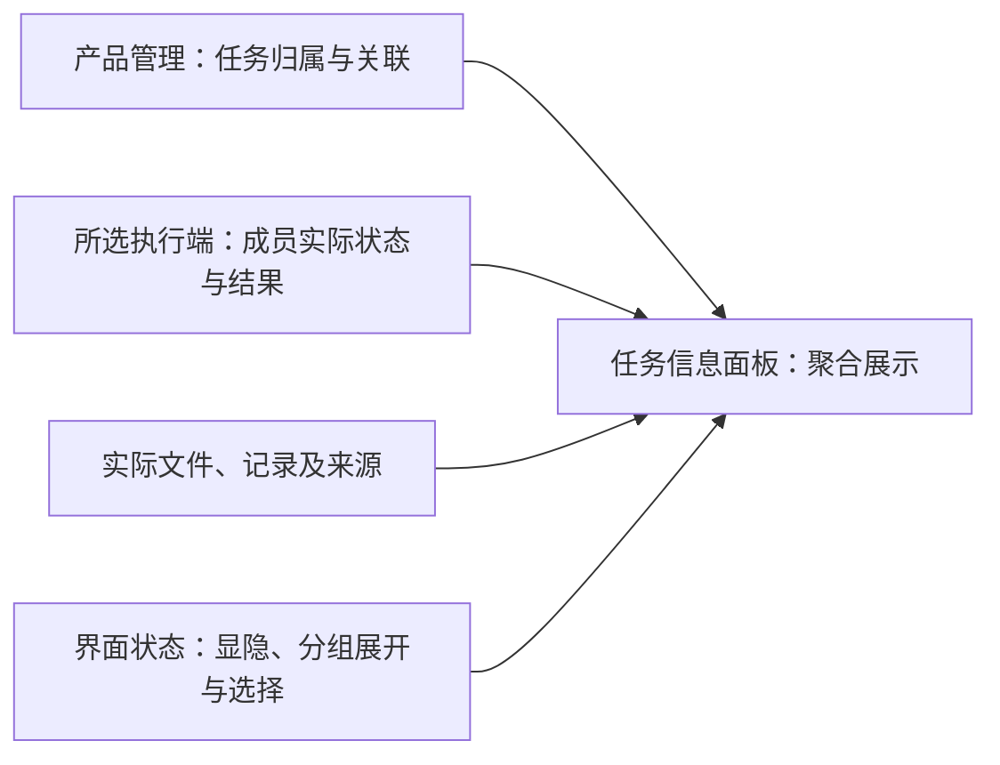

# 开发任务路径

状态：首条完整路径及第二轮布局、交互已确认，部分第二轮场景有独立模拟原型记录；2026-10-04 确认的无权限模式、主会话向成员授权及可隐藏任务信息面板尚未实现和验收。依据：507 同步的 Kimi 两轮交接及后续修订。本文件作为后续页面设计和相关规格的共同验收场景。

## 首条完整路径

新建任务 → 对话交代需求 → 观察工具执行 → 检查文件改动／diff（差异）→ 追问至验收。

沟通路径是这条路径的子集。工程推进先完成最小闭环，再补充信息密度；不以只有导航或只有聊天的页面宣布开发路径完成。任务和会话的归属遵守 [工作台信息架构](工作台信息架构.md)。

| 环节 | 设计和后续实现必须支持的可见结果 |
|---|---|
| 新建任务 | 用户知道任务属于哪个工作空间，以及将在哪里工作；新任务草稿首次发送可直接完成独立短期任务及主会话的建立 |
| 对话交代需求 | 用户能在任务所属会话内输入需求并开始工作 |
| 观察工具执行 | 用户能理解正在进行的动作、结果，以及是否需要自己处理问题 |
| 检查文件改动 | 用户能找到相关文件及差异，判断是否符合需求 |
| 追问至验收 | 用户能围绕同一任务继续提问和修正，并检查最终结果；模型声称完成不等于用户验收 |

## 布局 A：单时间线渐进披露

| 区域 | 职责与操作 |
|---|---|
| 左侧对象树 | 可拖宽；空间根节点始终可见，任务两级封顶；树行提供新建任务与跨空间移动入口 |
| 主区时间线 | 阅读列居中并设最大阅读宽度；消息、工具块、本轮改动聚合卡片与输入区共处。草稿态在此呈现问候、继续入口及推荐动作 |
| 右侧区域 | 提供可展开、保持显示及隐藏的任务信息面板，分组呈现成果与改动、协作进展、材料与来源；可进入逐文件差异／预览检查器，具体总览与详情组织由 UI 设计验证 |
| 设置 | 在主区内呈现，侧栏保留；返回方式与草稿保护遵守冷启动规格 |

工具块默认折叠为单行摘要，可就地展开查看执行输出；摘要和展开内容随实际状态更新。等待状态、成员向主会话申请授权及实际处理结果内联呈现，不设置主会话的用户审批卡或权限模式。工具失败块显示可复制错误；“本轮改动汇总”作为时间线上的聚合卡片，逐文件细节进入检查器。任务成果也可从右侧面板找到，面板不要求一直占据版面。

纯导航不影响执行：折叠树、切换会话、展开或隐藏任务信息面板、折叠分组、开闭检查器和进出设置不能改变运行状态。界面区分运行中、等待、失败、暂停与可恢复状态；本轮原型用模拟适配器，所有页面持续注明“未接 Pi”。

## 任务信息面板

507 已确认右侧面板作为当前任务的信息总览，可以保持展开，也能随时隐藏；功能入口持续可达，不依赖先打开某一条文件消息。面板包含下列可折叠分组，不新增工作空间 → 任务 → 会话之外的顶层导航对象。

| 分组 | 内容与行为 |
|---|---|
| 成果与改动 | 明确交付结果、实际文件或记录入口及改动概览；可查看文件／差异并回到来源消息，普通工具日志不自动成为成果 |
| 成员进展与关联任务 | 当前任务的成员及其实际进展，以及相关任务的入口与真实状态；保持各自归属，不因列入面板就转移任务或增加授权 |
| 材料与来源 | 与本任务相关的文件、链接和参考材料，保留可回查来源；登记或引用不等于已经读取，更不等于其中内容已成为执行指令 |

时间线、本轮改动卡片和面板读取同一结果、关联与状态来源，不各自形成可独立修改的内容副本或运行状态。文件、记录或来源失效时如实标示；没有读取到最新状态时，不伪报完成或将未知显示为成功。信息来源与界面状态的职责如下，当前未实现或验证。

隐藏面板或折叠分组不删除成果、成员、关联任务或来源，不改变任务执行、草稿或当前会话；再次展开仍可查看当前任务的信息。切换任务后核对对应归属，不把上一任务的信息误呈现为当前任务产出。面板显隐、分组展开与几何按 [冷启动与草稿态](冷启动与草稿态.md) 的界面恢复规则处理，不据此恢复执行。通过面板查看成员、关联任务、文件与来源属于导航，不因点击入口自动执行工作。

面板与差异检查器的具体切换或组合方式、默认显隐、分组顺序和窄窗口布局由 UI 设计验证。侧问继续采用悬浮气泡，不能因为任务信息面板改回与差异互斥的聊天页。关联任务和成员的呈现沿用 D Code 自身对象与协作范围，不照搬外部客户端的全部栏目或任务类型。

新增验收：从任务入口直接打开面板，找到成果与改动、成员及关联任务、材料与来源；各组可独立折叠，展开期间仍可继续对话；隐藏后阅读空间恢复，原信息、草稿和运行状态未被清除或改变；再次展开和切换任务时归属正确；成员状态来自实际记录，失效入口有真实反馈，导航未触发执行。与差异查看、悬浮侧问及中英文紧凑窗口共同验证。当前未实现或验收。

## 只读协作图

507 于 2026-10-04 选择首版提供只读协作图，并在查看会话内交互示意后认可列表／协作图可切换的方式。两种视图属于同一任务协作信息的不同呈现：列表便于逐项查看，图便于理解分工、负责人、实际状态与明确的协作关系；切换保留当前任务及正在查看的分工，不要求重新寻找目标。该交互方向已确认，不作为流程编辑器或新的执行入口；正式产品的尺寸、主题、双语与真实数据接入仍需验证。

节点呈现成员的一项分工或工作步骤，并标明对应成员；不把“一个 Agent 配置”“一次分工”“一条会话”强制当作同一对象。连线必须有已记录的关系依据，并说明所表达的是依赖还是其他协作关系；不能仅凭消息先后或模型猜测画出依赖。没有可用关系时，仍如实显示节点和状态。

用户可选择节点查看对应分工、当前状态、授权范围和可回查记录，并定位到已有会话或详情。图与成员列表读取相同事实，显隐、视图切换和节点选择只改变展示；图内不通过拖线、移动节点或选择来派工、授权、暂停或恢复。实际状态与未知、失败、等待须清楚区分，节点完成不自动代表用户已验收。

例如，验证分工明确需要界面交付与运行接入两份结果，前者已到、后者未到时，图应帮助用户看懂验证成员仍在等待哪项结果。这只是验收用示例，不能从示例反推实际项目已经存在这些成员或执行状态。图的来源与界面状态沿用 [任务信息面板](#任务信息面板) 的职责图，不另建一套可推进工作的状态。

本功能借鉴 Raven 的关系与状态展示，D Code 的分工和执行仍由既定产品运行层与 Pi 入口负责，不因画图而要求全部工作改用固定有向无环图调度，也不替换底座。固定版本证据及适配区别见 [架构约定](../doc/架构约定.md#补充参考的评审边界)。

验收覆盖：独立成员并行、分工明确等待另一项结果、失败或状态不可用；图与列表同源，双向切换后保持任务与当前选中分工，状态与记录一致；点击节点能回查真实依据；未知关系不伪造连线，查看与切换不改变执行。会话内示意的阅读方式已获 507 认可，仍没有真实 Pi 或产品运行验收。

## 六场景验收路径

1. 首次缺模型配置：Home 新任务草稿 → 内联提示 → 设置 → 配置保存并返回，草稿保留；未发送不建立正式任务。
2. 有历史：冷启动恢复上次会话；新草稿展示真实近期任务；点击近期任务只导航，推荐动作只填草稿。
3. 开始工作：从新任务草稿输入并发送需求 → 建立短期任务及主会话、确认首条输入接收 → 消息和工具摘要 → 就地展开执行输出；有成员授权请求时，内联展示主会话处理的真实状态，不要求用户逐项批准。
4. 检查改动与成果：从本轮文件聚合卡片或任务信息面板进入实际结果 → 查看逐文件差异／预览 → 继续追问；面板可保持展开，也可隐藏后再次打开，并能查看同任务的协作进展与材料来源。
5. 失败与恢复：失败块错误可复制；暂停后保存；重开恢复界面但执行等待用户。正常关闭和强制终止分别验证，只有恢复条的显式操作继续执行。
6. 对象移动或失效：定位对象当前归属；不存在时回 Home 新任务草稿，并以内联说明交代结果。

内容使用一份有长度和层级的开发任务，包含多轮交流、多文件差异、一次失败和一次由主会话处理的成员授权请求。授权规则以 [工作台信息架构](工作台信息架构.md#主会话与成员授权) 为准；第二轮原型中的用户权限确认保留为当时验证记录，不作为当前实现要求，也不因本次规则修订改写旧测试结果。视觉验证采用 中文／英文 × 13px／14px × 浅色／深色 × 紧凑／常规／宽窗口 × 六场景，逐项记录已验证与未验证；重点检查两种语言的字形密度、词长、换行、层级、焦点、截断和遮挡。双语从当前原型共同推进，不在中文页面验收后才追加英文排版。共享组件与设计变量形成可回查初稿，不把组件清单当作全部已经实现。

## 关联入口与共用设计

- 首次进入、冷启动两档、草稿态和缺模型配置提示统一见 [冷启动与草稿态](冷启动与草稿态.md)，不在本文件重复维护行为正文。
- 字号、主题、密度及组件来源方案统一见 [DESIGN](../DESIGN.md)。
- 开发任务中的用量与账户信息遵守 [用量与账户额度](用量与账户额度.md)，不把模型调用次数、任务 token 或费用估算混作账户剩余额度。

## 验证边界

本轮只记录路径和设计要求。后续以真实开发内容走完全部环节，并覆盖缺模型配置、工具执行失败及文件改动检查；具体反馈和继续方式随对应界面设计补齐。暂停、关闭与再次接续的场景遵守 [任务暂停与恢复](任务暂停与恢复.md)。已有模拟原型证据不自动覆盖新增成员授权规则，当前尚未完成集成验收，真实 Pi 未接入。
