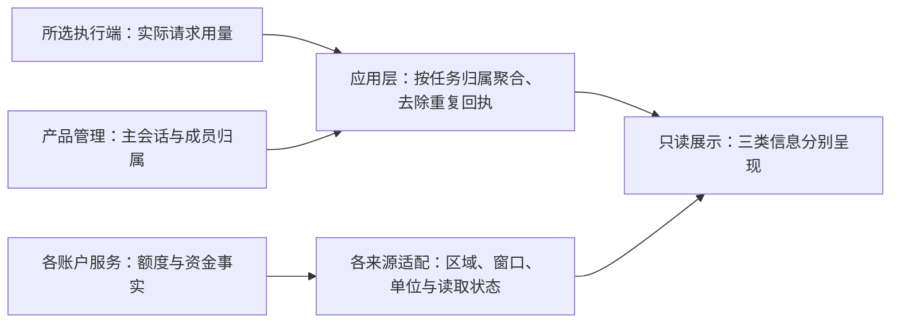

# 用量与账户额度

状态：507 于 2026-10-04 确认首版同时覆盖任务用量，以及能够可靠读取的账户订阅额度或资金信息。产品范围已确认；各服务支持范围、认证条件、字段与实际接入尚未验收。本规格不表示已接通任何用户账户，也不自动授权真实账户查询、依赖安装或修改现有 UI 原型。

## 目标与范围

让用户分别了解当前任务消耗了多少，以及所用服务账户还有多少可用额度或资金，便于安排多模型和成员工作。两类观察不能相互推算，也不能合并成一个无来源的“统一余额”。

| 信息类型 | 呈现的含义 | 数据依据 |
|---|---|---|
| 订阅额度 | 对应服务与套餐在具体使用窗口内的已用／剩余比例或数量、重置时间 | 该服务实际返回且语义已核实的账户数据；保留窗口与单位，未知字段不补造 |
| 模型服务账户资金 | 可用余额与实际花费，标明币种和对应期间 | 账户服务提供的资金事实；实际花费与本任务估算分开 |
| 任务用量 | 当前任务主会话与成员可归属的输入、输出、缓存 token（模型计量单位），以及有价格依据时的估算费用 | 所选执行入口实际记录的用量、任务归属及明确的价格依据；覆盖不完整时如实说明 |

同一账户可能用于多个任务，账户额度不能伪装成当前任务专属余额。任务汇总明确计量范围，能对应主会话与成员的实际记录；其他关联任务不因出现在任务信息面板就被重复计入。

## 数据解释与异常反馈

- 按服务、账户及区域识别来源，显示适用窗口、单位、更新时间与过期状态。配置相似、模型名称相同或使用同一虚拟模型入口，不足以证明属于同一计费账户。
- 用量依据可核实的实际执行来源归属。虚拟模型的显示名称不能替代实际服务／账户证据；路由身份或计量记录不可得时说明缺口，不推测费用归属。
- 缺少字段显示未知；没有可用接入说明暂不支持；查询失败说明失败。均不显示为零，也不把读取失败解释成额度已经耗尽。
- 保留上次成功数据时明确其时间与过期状态，不能伪装为最新。一个来源失败不抹掉其他来源已有的有效数据。
- 百分比、次数、积分、token 与不同币种分别保留语义。输入与缓存字段是否重叠、使用比例与剩余比例的含义，按来源核实，不机械相加或套用同一字段名。
- 估算费用有明确的模型、价格与计费规则依据，显示为估算；缺少依据时不报伪精确金额。不能以任务 token 推算账户剩余额度，也不能把估算当作实际账单。
- 重复回执或重开后的记录回放不重复计量；真实新增请求产生的可核实用量按事实记录，不能仅因输入文字相同而丢弃。无法确认完整性时明确统计范围，不能以零补齐。
- 各服务独立适配后统一呈现，凭据按已有服务与区域配置使用，不跨区域试发。支持哪些服务及哪些字段，以核验结果形成明确清单；本轮不预先承诺 MiniMax、Codex、Kimi、Z.ai 均能接通。

## 状态归属与呈现

执行端拥有实际请求用量记录，账户服务拥有额度与资金事实；应用层根据任务归属与经核验的字段语义形成只读汇总，界面不建立第二份可独立推进的用量或账户余额。

基础摘要应方便查看，详细来源和统计范围按需展开。摘要的位置、密度及双语、窄窗口呈现由 UI 设计结合当前单时间线和任务信息面板验证，本次不把全部账户指标固定铺满工作台。查看或刷新信息不改变任务执行，不发送工作输入，也不解除暂停。

接近服务限制等提示须基于有明确含义且时效可辨的数据；不使用过期或缺失数据制造“仍可用”或“已耗尽”的确定结论。

## 验收场景

| 条件与操作 | 应得到的结果 |
|---|---|
| 主会话与多个成员产生可归属用量 | 任务汇总与实际记录对应，能够区分计量范围；没有将关联任务或重复事件再次计入 |
| 同一账户被多个任务使用 | 账户窗口与余额按账户呈现，任务消耗按各任务呈现，不相互推算 |
| 服务返回订阅额度、余额或任务用量中的一部分 | 已有信息可见，缺失类型或字段明确未知／暂不可用，不补零或混淆单位 |
| 刷新失败、服务暂不支持或数据过期 | 如实呈现不同原因；旧数据保留来源时间，其他有效来源不被清空 |
| 重开后读回记录，或收到重复用量回执 | 同一事实不重复计量，任务不因查看统计而恢复执行 |
| 虚拟模型路由到不同服务，或计量身份无法确认 | 按实际可核实来源分开显示；缺口可辨，不用虚拟模型名称猜账户消耗 |
| 费用有／无明确价格依据，或币种、窗口不同 | 有依据时显示可回查的估算，缺依据不伪报金额；实际花费、估算及不同币种窗口不混合 |
| 在中文／英文、紧凑／常规窗口查看与展开详情 | 来源、单位、更新时间及异常状态可读，主要工作操作不被遮挡 |

接口选择、认证适用范围与字段稳定性由调度会话核实，研究归宿见 [架构约定](../doc/架构约定.md#补充参考的评审边界)。无真实账户查询、模拟数据与真实接入验证分别记录；当前尚无本功能的运行验收证据。
